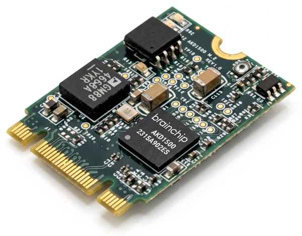

<!-- GENERATED FILE: edit akida1/docs/README.md.template, then run akida1/update_readme.py -->

  <picture>
    <source media="(prefers-color-scheme: dark)" srcset="../docs/assets/0_-BC-dev-hub-LOGO-flicker-dark.svg">
    
  </picture>

  
  
  
  
  

  
  
  
  

# Akida 1

  <a href="#the-technology"><u>Technology</u></a> ·
  <a href="#chips-and-boards"><u>Hardware</u></a> ·
  <a href="#model-zoo"><u>Model Zoo</u></a> ·
  <a href="#tutorials"><u>Tutorials</u></a>

Everything here targets the Akida 1 platform:

- **[Model zoo](#model-zoo).** Ready-to-run models:
  - each one covers data, training, quantization, conversion and evaluation
  - each is benchmarked on real **AKD1500** hardware (latency, power, energy per inference)
  - they're meant mainly as starting points to adapt to your own task
- **[Tutorials](#tutorials)** *(coming)*. A series that explains how the Akida 1 technology works in depth.

> 🚧 **Work in progress.** Content is being added and refined regularly.

---

## The technology

Akida is BrainChip's event-based neural processor. It computes only on non-zero
activations, so **activation sparsity directly saves energy and time**. Weights and activations
are low precision (1, 2 or 4 bits; 8-bit at the input). You build and train a standard Keras model,
quantize it (usually with quantization-aware training), then convert it with
[`cnn2snn`](https://doc.brainchipinc.com). The whole network runs on-chip, spread across
the chip's Neural Processors (NPs), with no host involvement between layers.

## Chips and boards

| Chip | NPs | HWPR enabled† | |
| --- | :---: | :---: | --- |
| **AKD1000** | 80 | No | The first Akida 1 silicon |
| **AKD1500** | 32 | Yes | 22nm co-processor that connects to any host CPU/MCU over PCIe or SPI; the chip every benchmark here is measured on |

† **HWPR** (Hardware Partial Reconfiguration): a model too large to fit on the available NPs
all at once is split into a series of sub-models ("passes"), which are loaded one after another
for each inference.

**Boards:** AKD1000 M.2 and PCIe cards · AKD1500 M.2 (B+M key) and PCIe cards ·
[BrainBoard 1500](https://brainchip.com/press/brainchip-and-neuromorphyx-announce-an-akd1500-embedded-developer-board-bringing-neuromorphic-ai-to-the-embedded-engineering-community/)
by Neuromorphyx (Arduino Nicla form factor, SPI, on-board power measurement).
All are available from the [BrainChip Shop](https://shop.brainchipinc.com/).

  

---

## Model zoo

Each task links to its example folder, where you'll find the full model card, the
benchmarks for every mapping, and the steps to reproduce them.

### Image

<table>
  <thead>
    <tr>
      <th>Task</th>
      <th>Category</th>
      <th>Dataset</th>
      <th>Performance</th>
      <th>Energy (mJ/inf)</th>
      <th>Latency (ms)</th>
      <th>Notes</th>
    </tr>
  </thead>
  <tbody>
    <tr>
      <td rowspan="3"><a href="model_zoo/imagenet_akidanet">General image classification</a></td>
      <td rowspan="3">Classification</td>
      <td rowspan="3">ImageNet-1k</td>
      <td>69.93% top-1</td>
      <td align="right">27.102</td>
      <td align="right">103.186</td>
      <td>AkidaNet &alpha;=1.0</td>
    </tr>
    <tr>
      <td>61.92% top-1</td>
      <td align="right">7.304</td>
      <td align="right">27.560</td>
      <td>AkidaNet &alpha;=0.5</td>
    </tr>
    <tr>
      <td>46.32% top-1</td>
      <td align="right">2.569</td>
      <td align="right">11.533</td>
      <td>AkidaNet &alpha;=0.25</td>
    </tr>
    <tr>
      <td><a href="model_zoo/vww">Person detection</a></td>
      <td>Classification</td>
      <td>Visual Wake Words</td>
      <td>88.42% acc.</td>
      <td align="right">0.502</td>
      <td align="right">3.315</td>
      <td></td>
    </tr>
    <tr>
      <td><a href="model_zoo/plant_village">Plant disease recognition</a></td>
      <td>Classification</td>
      <td>PlantVillage</td>
      <td>99.43% acc.</td>
      <td align="right">9.389</td>
      <td align="right">45.786</td>
      <td></td>
    </tr>
  </tbody>
</table>

### Audio

<table>
  <thead>
    <tr>
      <th>Task</th>
      <th>Category</th>
      <th>Dataset</th>
      <th>Performance</th>
      <th>Energy (mJ/inf)</th>
      <th>Latency (ms)</th>
      <th>Notes</th>
    </tr>
  </thead>
  <tbody>
    <tr>
      <td><a href="model_zoo/speech_commands">Keyword spotting</a></td>
      <td>Classification</td>
      <td>Google Speech Commands</td>
      <td>93.06% acc.</td>
      <td align="right">0.026</td>
      <td align="right">0.114</td>
      <td>10 keywords + silence + unknown</td>
    </tr>
  </tbody>
</table>

### Time series

<table>
  <thead>
    <tr>
      <th>Task</th>
      <th>Category</th>
      <th>Dataset</th>
      <th>Performance</th>
      <th>Energy (mJ/inf)</th>
      <th>Latency (ms)</th>
      <th>Notes</th>
    </tr>
  </thead>
  <tbody>
    <tr>
      <td><a href="model_zoo/arrhythmia_classification">Heart arrhythmia detection (ECG)</a></td>
      <td>Classification</td>
      <td>MIT-BIH</td>
      <td>0.835 macro F1</td>
      <td align="right">0.185</td>
      <td align="right">0.625</td>
      <td>Inter-patient split</td>
    </tr>
  </tbody>
</table>

Performance is for the converted Akida model. Energy is **total** energy per inference
on AKD1500, and latency is from the same mapping. Both are taken from whichever mapping mode
uses the least energy. This table is generated from each example's `docs/metrics.json`.

---

## Tutorials

A series of notebooks is planned to build an in-depth understanding of Akida 1.
Here is what's coming:

| Tutorial | Status |
| --- | --- |
| Sparsity in Akida hardware | 🚧 In review |
| Developing sparse models | 📝 Planned |
| Mapping modes, and single- vs multi-pass models | 📝 Planned |
| Quantization with `cnn2snn` | 📝 Planned |
| Inputs to Akida 1: scaling and the specialised input layer | 📝 Planned |
| Transfer learning | 📝 Planned |
| 1D time-series example | 📝 Planned |
| AKD1000 vs AKD1500 | 📝 Planned |
