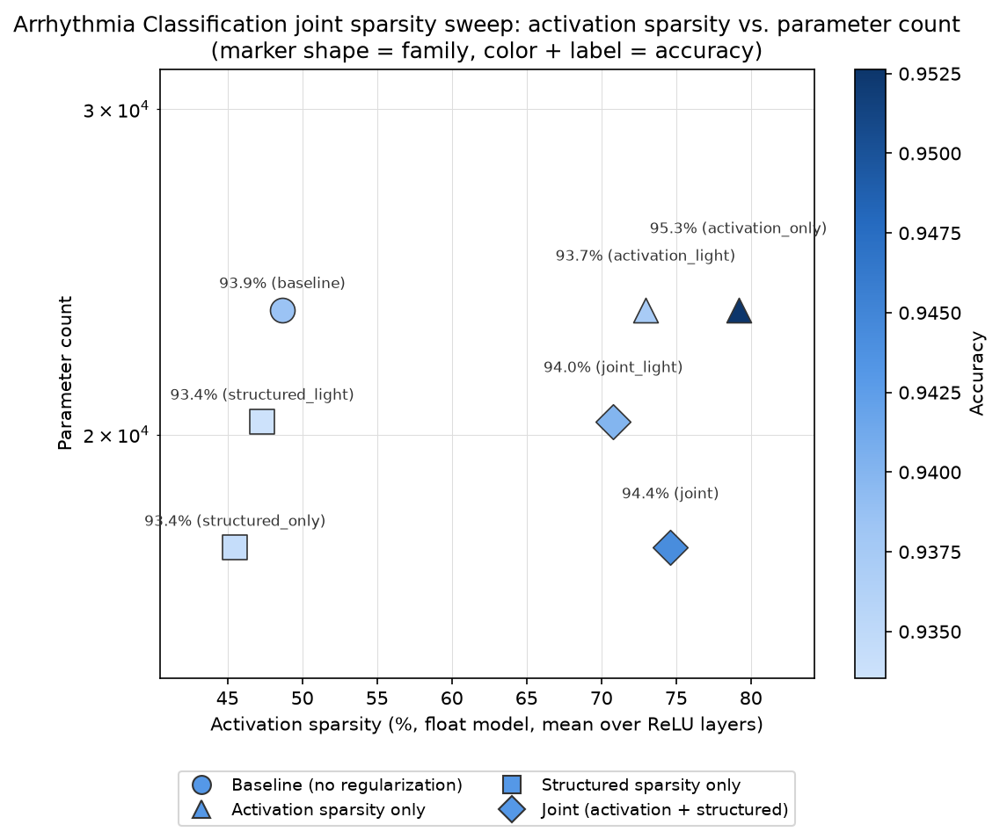

# Arrhythmia Classification joint activation + structured sparsity pilot

Tracking doc for a followup to **"Akida 1: Sparsify VWW model"** — applying the same
joint activation-sparsity + structured-sparsity investigation done on VWW,
PlantVillage and Speech Commands
([`../vww/JOINT_SPARSITY_EXPERIMENT.md`](../vww/JOINT_SPARSITY_EXPERIMENT.md),
[`../plant_village/JOINT_SPARSITY_EXPERIMENT.md`](../plant_village/JOINT_SPARSITY_EXPERIMENT.md),
[`../speech_commands/JOINT_SPARSITY_EXPERIMENT.md`](../speech_commands/JOINT_SPARSITY_EXPERIMENT.md))
to the ECG Arrhythmia Classification example (1D physiological signal -> CWT scalogram,
a fourth model/dataset/modality), to check whether any of the three prior patterns
(VWW: complementary; PlantVillage: antagonistic at aggressive settings, resolved by
going lighter; Speech Commands: sign of the interaction flips with strength, neither
point dominates) generalizes here.

- **Activation sparsity** (already explored in `SPARSITY_EXPERIMENT.md`): fraction of
  zero-valued ReLU activations, driven by an activity regularizer. Normalized
  Hoyer-Square at `reg=3` is the established best point (68.2% Akida-measured
  sparsity, only a ~0.9pt accuracy cost from the unregularized baseline -- the
  cheapest sparsity gain of any of the four model-zoo examples).
- **Structured (channel/filter) sparsity** (new): fraction of pruned SeparableConv2D
  output channels, which reduces the model's actual parameter count. Unlike
  activation sparsity, Akida 1 hardware does **not** accelerate on weight sparsity —
  this axis is about model footprint, not runtime latency.

Branch: `arrhythmia_classification-joint` (based on `akida1-sparsify-arrhythmia`).

**Headline result, up front:** a fourth distinct pattern. Unlike all three prior
studies, the aggressive `joint` configuration here **strictly dominates** the lighter
`joint_light` -- better accuracy, more sparsity, and a bigger parameter cut, all at
once, with no tradeoff at all. See Findings below.

## Scope decisions (same as the other three, ported)

- **Float models only.** No `cnn2snn quantize`/QAT/`convert`/Akida eval anywhere in
  this experiment, for the same reasons as the other three studies. Activation
  sparsity is measured directly on float ReLU outputs
  (`scripts/arrhythmia_float_sparsity.py`).
- **Structured sparsity method: Network Slimming** (Liu et al., 2017), implemented in
  `scripts/arrhythmia_structured_sparsity.py`. One implementation difference from the
  other three ports: this project's BatchNormalization layers are named `{block}_bn`
  rather than `{layer}/BN`, so the paired BN is located **positionally** (the layer
  immediately following the target in `model.layers`) instead of by a name-suffix
  convention -- more robust in general, since it doesn't assume any particular naming
  scheme.
- **Pruning scope**: `block1_sepconv` and `block2_sepconv` (2 of the model's 3
  SeparableConv2D blocks) are eligible for pruning. `block3_sepconv` (the final
  feature layer, feeding the classifier head via `GlobalAveragePooling2D`) is
  excluded, same reasoning as the other three examples. This model only has 3
  SeparableConv2D blocks total (vs. VWW's 10, PlantVillage's 10, Speech Commands' 4),
  so the prunable set is smaller here by construction.
- **Pilot scope**: a 2x2 grid -- baseline, activation-only, structured-only, and
  joint -- reusing `hoyer_square_norm reg=3` (no re-derivation) and a 40%
  per-layer channel-pruning starting guess (no prior data point on this axis, same
  situation as the other three studies).

## Differences from the other three examples' setup

- **No reusable training function.** Unlike VWW/PlantVillage/Speech Commands, whose
  `train.py` exposes a `train_*(model, ...)` function this series' sweep scripts
  import directly, this project's `scripts/train.py` runs float training,
  quantization, and QAT all inline in one `__main__` script with no importable
  training function. The joint sweep instead calls `build_akida_model`/
  `apply_activity_regularizer` directly and implements its own simple training loop
  (float-only, so no quantize/QAT stage is needed regardless).
- **Best-checkpoint reload.** `train.py`'s own convention is
  `ModelCheckpoint(monitor="val_loss", save_best_only=True)` +
  `EarlyStopping(patience=8, restore_best_weights=False)` -- meaning the live
  in-memory model after `fit()` is *not* necessarily the best one seen during
  training. The joint sweep reproduces this exactly: it reloads the checkpointed
  best-val-loss model after every training phase rather than using the post-`fit()`
  model directly.
- **Class-weighted loss.** `class_weights = {0: 1.0, 1: 6.0, 2: 3.0}` (pre-existing,
  addressing this dataset's severe class imbalance) is applied unchanged in every
  phase, matching `train.py`.
- **Epoch budgets are upper bounds, not fixed counts.** Phase 1 uses 80 epochs and
  Phase 2 (post-prune fine-tune) uses 40, both matching `train.py`'s float-training
  scale -- but `EarlyStopping(patience=8)` means actual training typically stops
  well before either ceiling, exactly as in the original single-axis experiment.
- **Data already preprocessed.** `data/processed/*.npy` (CWT scalograms with
  appended RR-interval feature rows, `(36, 32, 1)` per sample) already existed from
  the single-axis experiment, so no re-preprocessing of the raw MIT-BIH records was
  needed.

## Results

Ran on GPU 1 of a shared training server. Training is fast for this small model
(23,363 params, ~5-7s/epoch), so despite the two-phase-with-fine-tuning structure,
the full pilot (4 points) and follow-up (3 points) together took well under 20
minutes.

| tag | reg (hoyer_square_norm) | prune target | accuracy | acc. drop | activation sparsity | params (reduction) |
|---|---:|---:|---:|---:|---:|---:|
| baseline | 0 | 0% | 93.85% | -- | 48.7% | 23,363 (--) |
| activation_only | 3 | 0% | 95.26% | -1.41pt | 79.2% | 23,363 (0%) |
| activation_light | 1.5 | 0% | 93.73% | 0.12pt | 73.0% | 23,363 (0%) |
| structured_only | 0 | 40% | 93.44% | 0.41pt | 45.5% | 17,370 (25.7%) |
| structured_light | 0 | 20% | 93.35% | 0.50pt | 47.3% | 20,330 (13.0%) |
| **joint** | 3 | 40% | **94.43%** | **-0.57pt** | **74.6%** | **17,370 (25.7%)** |
| joint_light | 1.5 | 20% | 94.01% | -0.15pt | 70.8% | 20,330 (13.0%) |

Note: a *negative* accuracy drop means the configuration outperformed the
unregularized baseline -- see Findings below for why this happens on this dataset in
particular. Activation sparsity is measured directly on float ReLU outputs, not via
`akida_models.sparsity.compute_sparsity` on a quantized/converted model, so these
numbers aren't directly comparable to `SPARSITY_EXPERIMENT.md`'s Akida-measured
figures -- same caveat as the other three studies, valid to compare *within* this
table only.

## Findings

- **Activity regularization improves accuracy here, not just sparsity -- consistent
  with the single-axis experiment's own findings.** `activation_only` beats
  `baseline` by 1.41 points (93.85% -> 95.26%) while also gaining +30.5pt sparsity.
  `SPARSITY_EXPERIMENT.md` documented this same pattern in the single-axis sweep
  (non-monotonic, sometimes-improving accuracy vs. `reg`) and attributed it to this
  dataset's severe class imbalance and small minority-class sample counts, where mild
  regularization plausibly acts as a generalization aid rather than pure capacity
  reduction -- unlike VWW/PlantVillage/Speech Commands, where every activation
  regularizer tested cost at least some accuracy.
- **The `joint` configuration also beats baseline, and by nearly as much as
  `activation_only` alone.** `joint` reaches 94.43% accuracy (-0.57pt "drop", i.e.\
  a gain) with 74.6% activation sparsity and the full 25.7% parameter reduction
  `structured_only` achieves on its own. Structured pruning's small cost
  (`structured_only`: 0.41pt) is more than offset by activation regularization's
  accuracy gain when combined.
- **A genuinely novel pattern: `joint` strictly dominates `joint_light`.** Unlike all
  three prior studies -- where the lighter joint point either simply cost less (VWW),
  strictly won on every axis (PlantVillage), or traded one axis for another with no
  overall winner (Speech Commands) -- here the *aggressive* configuration is better
  on **every axis at once**: higher accuracy (94.43% vs. 94.01%), higher sparsity
  (74.6% vs. 70.8%), and a larger parameter cut (25.7% vs. 13.0%). There is no
  tradeoff to make; more regularization and more pruning both simply help, up to the
  strengths tested.
- **This is consistent with, not contradictory to, `SPARSITY_EXPERIMENT.md`'s own
  observation that this project never found a collapse point for any regularizer
  type**, even at 30-100x the strength that fully destroyed the other three models'
  accuracy. The class-weighted loss plausibly makes the "collapse to majority-class"
  failure mode -- the mechanism behind every other project's eventual accuracy
  cliff -- much less attractive here, so pushing regularization/pruning harder within
  the range tested keeps paying off rather than eventually costing accuracy.

## Recommendation

**`joint` (reg=3, prune_target=40%) is an unambiguous win** -- it should be preferred
over every other configuration tested, including its own lighter variant, since it is
better on every measured axis. This is a meaningfully different situation from the
other three studies, where choosing an operating point required a genuine judgment
call about which axis to prioritize.

## Open questions / next steps

- **Since `joint` dominates `joint_light` here, has the ceiling been found?** Given
  `SPARSITY_EXPERIMENT.md`'s own note that this project's single-axis sweep never
  located a collapse point even at 30-100x today's `reg`, it's plausible that pushing
  `reg` and/or `prune_target` even higher than this pilot's "aggressive" corner would
  continue to help rather than start hurting. A follow-up sweep at, e.g., `reg=10`
  and `prune_target=60%` would test whether the dominance pattern holds further out
  or eventually reverses.
- **This dataset's noise floor should be kept in mind before over-trusting these
  exact numbers.** `SPARSITY_EXPERIMENT.md` flagged non-monotonic, seed-sensitive
  results throughout its own sweep on this small, heavily-imbalanced dataset (49,280
  test beats, but very few training examples for the minority S/V classes). The
  accuracy *gains* reported here (e.g. `joint`'s -0.57pt "drop") are plausible but
  have not been confirmed across multiple seeds -- re-running the best few
  configurations with different seeds would help separate real signal from
  run-to-run variance before treating "`joint` strictly dominates" as a firm
  conclusion rather than "best of the points sampled in this one run."
- Same as the other three studies: no real hardware latency/power validation in this
  study (float-only, and Akida 1 doesn't accelerate on weight sparsity regardless) --
  the parameter reduction is a footprint argument, not a latency one.
