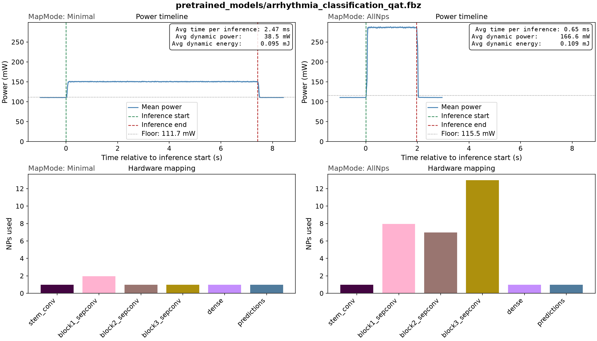
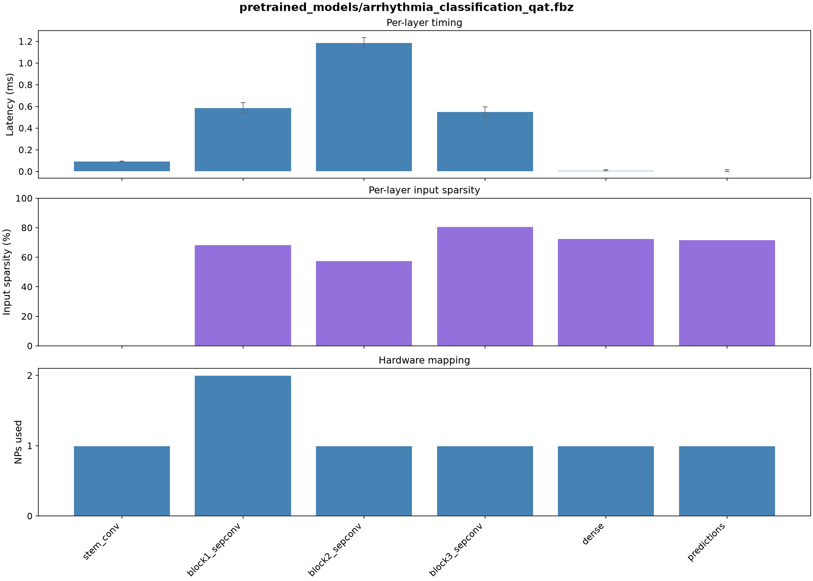

# Arrhythmia Classification (ECG)

Beat-by-beat classification of ECG recordings into three clinically meaningful
classes. Each heartbeat is turned into a small time-frequency image by a wavelet 
transform, which lets an ordinary 2D convolutional network do the work.

## Model Card

<table>
  <thead>
    <tr>
      <th>Data split</th>
      <th>Float acc.</th>
      <th>QAT acc.</th>
      <th>Akida acc.</th>
      <th>Macro F1</th>
      <th>Sparsity</th>
      <th>Params</th>
    </tr>
  </thead>
  <tbody>
    <tr>
      <td>Inter-patient (DS1/DS2)</td>
      <td align="center">94.76%</td>
      <td align="center">95.80%</td>
      <td align="center">95.77%</td>
      <td align="center">0.835</td>
      <td align="center">58.60%</td>
      <td align="center">23,363</td>
    </tr>
    <tr>
      <td>Naive random</td>
      <td align="center">99.28%</td>
      <td align="center">99.15%</td>
      <td align="center">99.15%</td>
      <td align="center">0.958</td>
      <td align="center">57.06%</td>
      <td align="center">23,363</td>
    </tr>
  </tbody>
</table>

Two sets of results are included here for the same model and the same training
pipeline. The only difference is how the beats were divided. The naive dataset 
split is at random across all beats; the inter-patient version keeps
every patient wholly on one side (according to a standardized split)
so the model is tested on data from people it has genuinely never seen. 
See the [Dataset limits](#dataset-limits) for a full discussion.

**AKD1500 hardware benchmark**

<table>
  <thead>
    <tr>
      <th>Mapping</th>
      <th>NPs</th>
      <th>Passes</th>
      <th>Cycles</th>
      <th>Latency (ms)</th>
      <th>Total Power (mW)</th>
      <th>Total Energy (mJ/inf)</th>
      <th>Dyn. Power (mW)</th>
      <th>Dyn. Energy (mJ/inf)</th>
    </tr>
  </thead>
  <tbody>
    <tr>
      <td>Minimal</td>
      <td align="center">TBD</td>
      <td align="center">TBD</td>
      <td align="center">TBD</td>
      <td align="center">TBD</td>
      <td align="center">TBD</td>
      <td align="center">TBD</td>
      <td align="center">TBD</td>
      <td align="center">TBD</td>
    </tr>
    <tr>
      <td>AllNPs</td>
      <td align="center">TBD</td>
      <td align="center">TBD</td>
      <td align="center">TBD</td>
      <td align="center">TBD</td>
      <td align="center">TBD</td>
      <td align="center">TBD</td>
      <td align="center">TBD</td>
      <td align="center">TBD</td>
    </tr>
  </tbody>
</table>



The plot above shows power measurements captured during inference on hardware.
In **Minimal** mapping the model is scheduled onto the fewest NPs required,
keeping power consumption low. Switching to **AllNps** spreads the model across
more NPs (visible in the lower trace plots), which results in a slight increase
in power during inference but a proportional reduction in latency.

The model is a small custom depthwise-separable network: a dense 16-filter stem
convolution, three separable convolution blocks of 32, 64 and 128 filters with
stride-2 max pooling between them, then global average pooling and two dense
layers. It maps to **6 Akida layers in a single pass**, with the whole network
resident on-chip and no DMA traffic during inference.

Latency can also be profiled on a per-layer basis, making it possible to see
which layers dominate processing time. This is determined by several factors:
the volume of inputs to the layer and its number of filters, the type of layer
and kernel size, and the number of NPs the layer is spread over. On Akida,
input activation sparsity is another strong determinant — layers where input
sparsity is particularly high take very little processing time.



## Requirements

For environment requirements and setup, see the [Requirements](../../../README.md#requirements)
section of the top-level README.

## Dataset

The [MIT-BIH Arrhythmia Database](https://physionet.org/content/mitdb/1.0.0/)
is the long-standing benchmark for cardiac rhythm analysis: 48 half-hour
two-lead ambulatory ECG recordings, sampled at 360 Hz, with around 110,000
cardiologist-annotated heartbeats. This example uses the first lead only.

Beat annotations are grouped into three classes following AAMI practice. Beat
types outside these groups (paced, fusion and unclassifiable beats) are dropped
rather than forced into a class (because too few samples are included in the 
dataset to be meaningful):

| Class | Included beat types |
|---|---|
| N — Normal | Normal sinus rhythm, left/right bundle branch block, atrial and nodal escape |
| S — Supraventricular | Atrial premature, aberrated atrial premature, nodal premature, supraventricular premature |
| V — Ventricular | Premature ventricular contraction, ventricular escape |

In the pipeline used here, each beat becomes a **36 × 32 single-channel image**:

1. A window of ±250 samples around the annotated R-peak is extracted and
   resampled to a fixed length.
2. A Morlet continuous wavelet transform over 64 scales produces a scalogram,
   which is log-compressed, min-max normalised, and resized to 32 × 32.
3. Four **RR-interval features** are standardised and appended as four extra 
   rows: the previous and next beat intervals, the ratio to a local average, 
   and that local average

Those RR rows matter more than their size suggests. A supraventricular beat can
look much like a normal one in isolation; what distinguishes it is arriving
early relative to the surrounding rhythm. The scalogram carries the morphology,
the RR rows carry the timing, and the network needs both.

The pipeline supports two ways of dividing those beats, both reported in the
model card above:

- **Inter-patient** (the default, and the standard DS1/DS2 protocol): 22
  recordings for training and a disjoint 22 for testing, so no beat from a test
  patient is ever seen during training. A stratified 20% of the *training*
  patients' beats is held back for monitoring during training.
- **Naive random** (`--naive-split`): all 99,839 beats pooled and divided
  60/20/20 at random, stratified by class, patients ignored.

The classes are severely imbalanced whichever way the beats are divided, which
drives the class weighting used in training. The inter-patient breakdown:

| Split | N | S | V | Total |
|---|---:|---:|---:|---:|
| Train (DS1, 80%) | 36,663 | 754 | 3,030 | 40,447 |
| Hold-out (DS1, 20%) | 9,166 | 189 | 757 | 10,112 |
| Test (DS2) | 44,224 | 1,837 | 3,219 | 49,280 |

Reference: Moody & Mark, *The impact of the MIT-BIH Arrhythmia Database*,
IEEE Eng in Med and Biol 20(3):45-50 (2001).

## Dataset limits

Both splits are reported because neither one, on its own, supports the claim a
reader usually wants to make from it.

**The naive split is easy.** Pooled and divided at random, this model reaches
99.15% accuracy with an S-class F1 of 0.908. A great
deal of the published work on MIT-BIH reports numbers of this kind, and they are
real in one sense: the model has genuinely learned to tell the three beat
classes apart. But the test beats come from the same patients as the training
beats, so the figure says nothing about ability to generalise to new patients. A
[2025 systematic review](https://arxiv.org/html/2503.07276v1) found only 5 of
122 surveyed papers combined AAMI compliance with a fair inter-patient
evaluation, and documents one CNN falling from 99.48% accuracy and 98.83%
S-class precision to 88.34% and 48.25% with nothing changed but the split.

**The inter-patient split is honest but narrow.** It fixes the leakage, and it
is the number to quote, but it is a small-sample measurement wearing the
clothes of a large one. Of the 1,837 S beats in DS2, roughly 1,382 come from
record 232 and 209 from record 222: about 87% of the class from two patients
([per-record counts](https://pmc.ncbi.nlm.nih.gov/articles/PMC3142238/)). DS1 is
no better, with over half of its 943 S beats from record 209. So the S-class
score largely measures whether the model happens to fit the rhythm
idiosyncrasies of one bradycardic patient, having learned from about two
patients' worth of S morphology. It moves a long way with the random seed:
re-run the pipeline with a different `SEED` to test.

**So neither split settles an architecture question.** The naive result
demonstrates that the model can learn the discriminative features; the
inter-patient result shows what survives contact with a new person. Neither is
precise enough to rank two reasonable architectures a few points apart, on this
dataset, with this class distribution. An inter-patient S-F1 improvement is 
more likely to reflect accidental overfitting to the test data than any 
genuine improvement in model generalisation.

**About these figures.** They come from a single run at seed 7. Re-running will
not reproduce them unless exact reproducibility is enfoced (identical random
seeds throughout, and deterministic ops explicitly used; even running on 
different hardware will generate very different results). The models in `pretrained_models/`
are the ones these numbers were measured from, so the *evaluation* reproduces even
though the training on a different machine likely does not.

Accuracy alone flatters any model on this dataset: 90% of the test beats are
normal, so predicting "normal" unconditionally scores 0.90. The per-class
breakdown of the deployed Akida model on the inter-patient test set is the
honest summary, and the supraventricular (S) row is the hard one for all the
reasons above.

<table>
  <thead>
    <tr>
      <th>Class</th>
      <th>Precision</th>
      <th>Recall</th>
      <th>F1</th>
      <th>Support</th>
    </tr>
  </thead>
  <tbody>
    <tr>
      <td>N — Normal</td>
      <td align="center">0.988</td>
      <td align="center">0.968</td>
      <td align="center">0.978</td>
      <td align="center">44,224</td>
    </tr>
    <tr>
      <td>S — Supraventricular</td>
      <td align="center">0.583</td>
      <td align="center">0.705</td>
      <td align="center">0.638</td>
      <td align="center">1,837</td>
    </tr>
    <tr>
      <td>V — Ventricular</td>
      <td align="center">0.833</td>
      <td align="center">0.956</td>
      <td align="center">0.890</td>
      <td align="center">3,219</td>
    </tr>
  </tbody>
</table>

## Dataset setup

Data preparation is handled automatically be the scripts. The raw recordings
(~100 MB) are downloaded from PhysioNet automatically the first time you run
any script, and the preprocessed scalograms are cached alongside them:

```text
data/mitdb/                        raw WFDB recordings, downloaded on demand
data/mitdb_scalograms_36x32.npz    preprocessed cache, built on first use
```

Building the cache runs the wavelet transform over all ~100,000 beats and takes
about a minute with all cores busy. It happens once; later runs read the cache.

If you already have the records, or want them on a dedicated data drive, pass
the path with `-d` / `--data`, or link the default location to it (one-off step):

```bash
ln -s /path/to/your/data/mitdb ./data/mitdb
```

To fetch them by hand instead:

```bash
wget -r -np -nH --cut-dirs=3 https://physionet.org/files/mitdb/1.0.0/ -P ./data/mitdb
```

## Pipeline

Training follows a three-stage quantization pipeline, followed
by conversion to Akida format:

| Stage | Description |
|---|---|
| Full-precision | Float32 training from scratch, up to 80 epochs |
| Post-training quantization | `cnn2snn quantize` reduces to 4-bit weights and activations (8-bit input) |
| Quantization-aware tuning | Up to 50 epochs fine-tuning of the quantized model to recover accuracy |
| Conversion to Akida | Automated conversion to Akida model format |

Both training stages reduce the learning rate on plateau and stop early once
validation loss stops improving, so the epoch counts above are ceilings rather
than exact durations.

## Reference Models

Pretrained models are made available here, within the `pretrained_models/`
folder. However, those are handled using the `git-lfs` package (git large
file storage). For those to be downloaded with the repo, you will need to
set up `git-lfs`. For further instructions, see the
[Trained models](../../../README.md#trained-models) section of the top-level README.

## Usage

### Notebook

Two notebooks are provided that walk through a) preparation of a trained Akida-compatible model and
b) evaluation and benchmarking of that model on Akida.

[arrhythmia_notebook_training.ipynb](arrhythmia_notebook_training.ipynb) walks through the
complete training pipeline end-to-end. It is written to expose and explain the Akida-specific
aspects of the workflow: how an ECG signal becomes an image the network can
consume, how the model is constructed for Akida compatibility, what the
quantization constraints mean in practice, and what the conversion step does.
Start here if you want to understand *why* the pipeline is structured the way it
is.

[](https://colab.research.google.com/github/Brainchip-Inc/brainchip_devhub/blob/main/akida1/model_zoo/arrhythmia_classification/arrhythmia_notebook_training.ipynb)

[arrhythmia_notebook_benchmark.ipynb](arrhythmia_notebook_benchmark.ipynb) walks through
evaluation of model accuracy on Akida and, if a hardware device is available, covers benchmarking
of model latency and power.

> **Note:** the hardware benchmark section reads live power measurements from a physical AKD1500
> device over I2C. It will not run in Colab — use it locally with a connected board.

### Script

For straightforward reproduction of the training and evaluation results, run
the full pipeline in one shot:

```bash
bash arrhythmia_train.sh [DATADIR]              # inter-patient split, the reported setting
bash arrhythmia_train_naive_split.sh [DATADIR]  # naive random split
```

The optional `DATADIR` argument overrides the default dataset location
(`./data/mitdb`). `SEED` may be set the same way and defaults to 7, the seed the
reported figures come from.

The individual scripts take `--naive-split` directly
(`arrhythmia_train.py --naive-split`, `arrhythmia_eval.py --naive-split`). The
naive partitions are drawn from the seed, so training and evaluation must be
given the same `--seed`; both default to 7.

That will take about 15 minutes to run if a modern GPU is available, plus a
minute for the one-off dataset download and preprocessing.

## Contributing and Maintenance

This README is autogenerated generated from `docs/README.md.template`
so that the accuracy and hardware benchmark values are written directly
by the code (via the `metrics.json` file, also in the docs folder).

When the associated model or training pipeline is modified to improve
performance, you should rerun the evaluations of the float, quantized
and Akida model versions, plus the hardware benchmark, including the
`--save-metrics` argument, and then regenerate the README from the template
using `update_readme.py`:
```bash
python arrhythmia_eval.py -l pretrained_models/arrhythmia_classification.h5 --save-metrics
python arrhythmia_eval.py -l pretrained_models/arrhythmia_classification_qat.h5 --save-metrics
python arrhythmia_eval.py -l pretrained_models/arrhythmia_classification_qat.fbz --save-metrics
python arrhythmia_benchmark.py -l pretrained_models/arrhythmia_classification_qat.fbz --save-metrics
python update_readme.py
```

The model card also reports the naive split, whose figures are stored under
`naive_`-prefixed keys and come from models trained with `NAIVE=1`. Keep those
in `pretrained_models/` under a `_naive` suffix so the row stays checkable, and
refresh them the same way:
```bash
python arrhythmia_eval.py -l pretrained_models/arrhythmia_classification_naive.h5 --naive-split --save-metrics
python arrhythmia_eval.py -l pretrained_models/arrhythmia_classification_naive_qat.h5 --naive-split --save-metrics
python arrhythmia_eval.py -l pretrained_models/arrhythmia_classification_naive_qat.fbz --naive-split --save-metrics
python arrhythmia_benchmark.py -l pretrained_models/arrhythmia_classification_naive_qat.fbz --naive-split --save-metrics
python update_readme.py
```
Everything in the accuracy table, activation sparsity included, is written by
`arrhythmia_eval.py` on the software backend, so the table can be refreshed
without an Akida device. Only the hardware benchmark table needs one.
`--naive-split` on the benchmark changes only which metrics keys and figure
files are written — the samples are real beats either way — but without it a
naive run would overwrite the deployed model's hardware numbers and reference
figures.

Then commit the changed files (template, metrics and updated README).

Likewise, if you want to edit the contents of this README, you should
not edit it directly, but instead edit `docs/README.md.template` and
then regenerate the README using
``` bash
python update_readme.py
```
