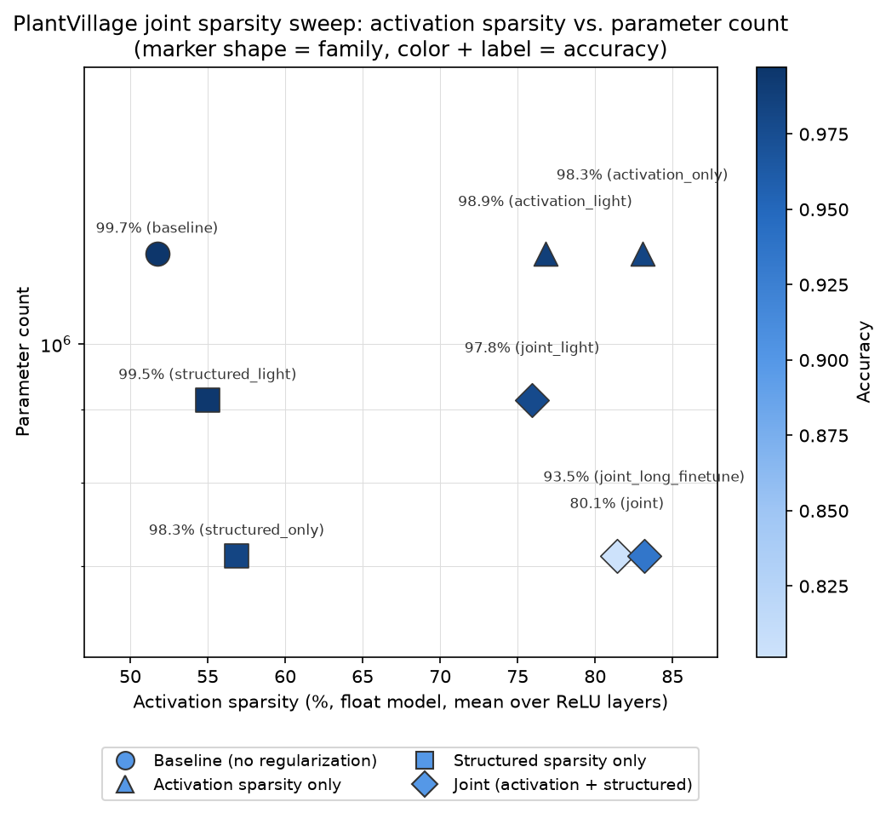

# PlantVillage joint activation + structured sparsity pilot

Tracking doc for a followup to **"Akida 1: Sparsify VWW model"** — applying the same
joint activation-sparsity + structured-sparsity investigation done on VWW
([`../vww/JOINT_SPARSITY_EXPERIMENT.md`](../vww/JOINT_SPARSITY_EXPERIMENT.md)) to the
PlantVillage disease-classification example, to check whether VWW's findings
generalize to a different model/dataset:

- **Activation sparsity** (already explored in `SPARSITY_EXPERIMENT.md`): fraction of
  zero-valued ReLU activations, driven by an activity regularizer. `hoyer_square_norm`
  at `reg=36` was the established best point (78.2% Akida-measured sparsity, ~1.5pt
  accuracy cost).
- **Structured (channel/filter) sparsity** (new): fraction of pruned SeparableConv2D
  output channels, which reduces the model's actual parameter count. Unlike
  activation sparsity, Akida 1 hardware does **not** accelerate on weight sparsity —
  this axis is about model footprint, not runtime latency.

Branch: `akida1-sparsify-plantvillage-joint` (worktree, based on
`akida1-sparsify-plantvillage`).

**Headline result, up front: unlike VWW, the two axes are *not* complementary here at
aggressive settings** — see Findings below. Lighter joint settings avoid the problem
and are the recommended operating point, same conclusion as VWW reached but for a
different underlying reason.

## Scope decisions (same as VWW, ported)

- **Float models only.** No `cnn2snn quantize`/QAT/`convert`/Akida eval anywhere in
  this experiment, for the same reasons as VWW (sidesteps the hardware-vs-software
  sparsity-simulator discrepancy; keeps channel pruning decoupled from quantization
  concerns). Activation sparsity is measured directly on float ReLU outputs
  (`plant_village_float_sparsity.py`).
- **Structured sparsity method: Network Slimming** (Liu et al., 2017), implemented in
  `plant_village_structured_sparsity.py` -- ported unchanged from
  `../vww/vww_structured_sparsity.py` (the implementation walks the model graph
  generically rather than hardcoding layer names, so it applies to PlantVillage's
  AkidaNet-alpha0.5 backbone without modification). BN-gamma L1 penalty during
  training, then magnitude-based channel pruning and a physical model rebuild.
- **Pruning scope**: `separable_4` .. `separable_12` (9 of the 10 `SeparableConv2D`
  blocks), identical relative scope to VWW. `conv_0`-`conv_3` (stem) and
  `separable_13` are excluded -- PlantVillage's classifier head is deeper than VWW's
  (`separable_13` -> `fc_1` Dense(512)+BN+ReLU -> `dropout_1` -> `predictions`
  Dense(38)), and pruning `separable_13` would require resizing `fc_1`'s input,
  extra risk not needed here either.
- **Pilot scope**: a 2x2 grid -- baseline, activation-only, structured-only, and
  joint -- reusing `hoyer_square_norm reg=36` (no re-derivation) and a 40%
  per-layer channel-pruning starting guess (no prior data point on this axis,
  same situation as VWW).

## Differences from VWW's setup

- **Data pipeline**: PlantVillage uses a `tf.data`-based pipeline
  (`plant_village_data.py`, via `tensorflow_datasets`) with `AUTOTUNE` prefetching
  already built in, unlike VWW's single-threaded `ImageDataGenerator`. No analogous
  `workers=`/`use_multiprocessing` fix was needed here -- the pipeline was already
  fast (~40-45s/epoch on the full ~54k-image dataset at 224x224, GPU 1 of the shared
  training box).
- **Epoch budget**: reused `plant_village_train.sh`'s existing schedule (10 float
  epochs @ 1e-3) for Phase 1, rather than VWW's raised 40-epoch budget -- this model
  already reaches 99%+ accuracy in 10 epochs per the published baseline, and Pass 1
  of the original single-axis experiment confirmed more epochs weren't needed before
  regularization was introduced. Phase 2 (post-prune fine-tune) started at 5 epochs
  (proportionally similar to VWW's 40:15 ratio), though see Findings below for why
  this budget turned out to matter a lot more here than it did for VWW.
- **Evaluation**: on the held-out **test** split, matching `plant_village_eval.py`'s
  own "Test accuracy" convention (VWW evaluates on its validation split instead,
  since it doesn't have a separate held-out test split).

## Results

Ran on GPU 1 of a shared training server; the whole experiment (pilot + two
follow-ups, 8 points total) took well under two hours end to end thanks to the
faster data pipeline.

| tag | reg (hoyer_square_norm) | prune target | phase-2 epochs | accuracy | activation sparsity | params (reduction) |
|---|---:|---:|---:|---:|---:|---:|
| baseline | 0 | 0% | -- | 99.72% | 51.7% | 1,156,054 (--) |
| activation_only | 36 | 0% | -- | 98.31% | 83.1% | 1,156,054 (0%) |
| activation_light | 15 | 0% | -- | 98.86% | 76.8% | 1,156,054 (0%) |
| structured_only | 0 | 40% | 5 | 98.32% | 56.9% | 711,624 (38.4%) |
| structured_light | 0 | 20% | 5 | 99.50% | 55.0% | 913,771 (21.0%) |
| joint | 36 | 40% | 5 | **80.15%** | 81.4% | 711,624 (38.4%) |
| joint_long_finetune | 36 | 40% | **20** | 93.48% | 83.2% | 711,624 (38.4%) |
| **joint_light** | **15** | **20%** | 5 | **97.81%** | **75.9%** | **913,771 (21.0%)** |

Note: activation sparsity is measured directly on float ReLU outputs, not via
`akida_models.sparsity.compute_sparsity` on a quantized/converted model, so these
numbers aren't directly comparable to `SPARSITY_EXPERIMENT.md`'s Akida-measured
figures (e.g. `reg=36`'s float sparsity here, 83.1%, vs. 78.2% Akida-measured for
the same `reg` there) -- same caveat as VWW, valid to compare *within* this table
only.

## Findings

- **Unlike VWW, the aggressive joint configuration is actively antagonistic, not
  complementary.** `activation_only` alone costs 1.42pt (99.72% -> 98.31%);
  `structured_only` alone costs 1.40pt (99.72% -> 98.32%); a naive sum predicts
  ~2.81pt for both together. The aggressive `joint` configuration instead costs
  **19.58pt** (99.72% -> 80.15%) at the default 5-epoch post-prune fine-tune budget
  -- an order of magnitude worse than either axis alone, and far worse than the
  naive additive prediction. This is the opposite of VWW's finding, where the joint
  corner cost *less* than the sum of its parts.
- **Tracing the cause: it's a pruning-recovery problem, not an unstable joint
  training run.** Phase 1 (both regularizers active together) trained perfectly
  cleanly -- validation accuracy climbed smoothly from 79.9% to 98.3% over the 10
  epochs, no instability. The collapse happens exactly at the prune step: Phase 2's
  first epoch opens at only 59.9% validation accuracy (down from 98.3% the epoch
  before, before any further training), and 5 fine-tuning epochs only claw back to
  78.9%. Channel pruning driven by BN-gamma magnitude, while the activation
  regularizer is simultaneously active, is evidently removing channels that matter
  more here than the same 40% removed under `structured_only`'s clean (no
  competing regularizer) gamma ranking.
- **Given enough fine-tuning time, most (not all) of the damage is recoverable.**
  `joint_long_finetune` (same `reg=36`/`prune_target=40%`, but 20 post-prune
  fine-tune epochs instead of 5) recovers to **93.48%** -- a huge improvement over
  80.15%, confirming the initial number was largely an under-trained-recovery
  artifact rather than irreversibly bad channel selection. But even with 4x the
  fine-tuning budget, it still costs 6.24pt versus the ~1.4pt either axis costs
  alone -- so some genuine antagonism between the two mechanisms remains at these
  aggressive settings, it's just much less severe than the 5-epoch number suggested.
- **Lighter joint settings sidestep the problem almost entirely.** `joint_light`
  (`reg=15`, `prune_target=20%`, same 5-epoch fine-tune budget as the aggressive
  `joint`) reaches **97.81%** accuracy (only a 1.92pt drop) with 75.9% activation
  sparsity and a 21.0% parameter reduction -- better on every axis than
  `joint_long_finetune` achieved even with 4x the fine-tuning time at the aggressive
  settings. Whatever makes aggressive joint pruning hard to recover from is much
  less of a problem at lighter regularization/pruning strengths.

## Recommendation

**`joint_light` (reg=15, prune_target=20%) is the clear best operating point found**
-- 97.81% accuracy (1.92pt drop from baseline) with meaningful gains on both axes
(75.9% activation sparsity, 21.0% fewer parameters), and it gets there with the same
modest 5-epoch fine-tuning budget that left the aggressive `joint` badly undertrained.
Unlike VWW, this is not a case of "the joint approach is a strictly good trade at
strong settings, an even lighter setting just wastes less accuracy budget" --
here the aggressive combination is a genuine trap (a >13pt-worse result than
`joint_light` even after quadrupling the recovery budget), and the practical
takeaway is to stay in the lighter regime for this model rather than push both
knobs hard simultaneously.

## Open questions / next steps

- **Why does aggressive joint pruning need so much more fine-tuning than either
  axis alone, or than the lighter joint setting?** The BN-gamma importance ranking
  may become less reliable once the activation regularizer is simultaneously
  suppressing the network's internal representations -- but this is a hypothesis,
  not confirmed. Comparing which specific channels get pruned under
  `structured_only` vs. under `joint` at the same `prune_target` (do they differ
  substantially?) would help confirm or rule this out.
- **`joint_long_finetune` still hasn't found the ceiling** -- it was only tested at
  20 phase-2 epochs; an even longer fine-tune (e.g. 40+, matching VWW's Phase 1
  scale) might close more of the remaining 6.24pt gap, or might plateau before that.
- **The reverse combination hasn't been tried**: light activation regularization
  with aggressive pruning, or vice versa, to see whether the antagonism specifically
  needs *both* knobs turned up, or whether either one alone at full strength is
  already enough to make pruning hard to recover from.
- Same as VWW: no real hardware latency/power validation in this study (float-only,
  and Akida 1 doesn't accelerate on weight sparsity regardless) -- the parameter
  reduction is a footprint argument, not a latency one.
