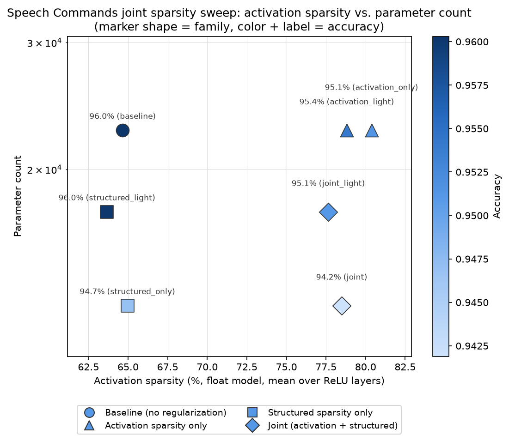

# Speech Commands joint activation + structured sparsity pilot

Tracking doc for a followup to **"Akida 1: Sparsify VWW model"** — applying the same
joint activation-sparsity + structured-sparsity investigation done on VWW and
PlantVillage ([`../vww/JOINT_SPARSITY_EXPERIMENT.md`](../vww/JOINT_SPARSITY_EXPERIMENT.md),
[`../plant_village/JOINT_SPARSITY_EXPERIMENT.md`](../plant_village/JOINT_SPARSITY_EXPERIMENT.md))
to the Speech Commands keyword-spotting example (DS-CNN, audio, not vision), to check
whether either of the two prior findings (VWW: complementary; PlantVillage: antagonistic
at aggressive settings) generalizes to a third model/dataset/modality.

- **Activation sparsity** (already explored in `SPARSITY_EXPERIMENT.md`): fraction of
  zero-valued ReLU activations, driven by an activity regularizer. Unlike VWW and
  PlantVillage, this project's established best point uses **raw** `hoyer_square`
  (not the normalized variant) at `reg=1e-4` (71.3% Akida-measured sparsity, ~3.1pt
  accuracy cost) -- normalized Hoyer-Square hasn't been separately validated here.
- **Structured (channel/filter) sparsity** (new): fraction of pruned SeparableConv2D
  output channels, which reduces the model's actual parameter count. Unlike
  activation sparsity, Akida 1 hardware does **not** accelerate on weight sparsity —
  this axis is about model footprint, not runtime latency.

Branch: `akida1-sparsify-speech-commands-joint`.

**Headline result, up front:** this example lands in between the other two. At the
aggressive settings tested, the joint corner is sub-additive (complementary) like VWW's
was -- but a lighter joint corner is *slightly* super-additive (a small surprise cost,
unlike VWW). Neither joint point strictly dominates the other here, unlike PlantVillage
where the light point was a strict win on every axis. See Findings below.

## Scope decisions (same as VWW/PlantVillage, ported)

- **Float models only.** No `cnn2snn quantize`/QAT/`convert`/Akida eval anywhere in
  this experiment, for the same reasons as the other two studies. Activation sparsity
  is measured directly on float ReLU outputs (`speech_commands_float_sparsity.py`).
- **Structured sparsity method: Network Slimming** (Liu et al., 2017), implemented in
  `speech_commands_structured_sparsity.py` -- ported unchanged from
  `../vww/vww_structured_sparsity.py` (architecture-agnostic, walks the model graph
  rather than hardcoding layer names).
- **Pruning scope**: the 3 "plain" separable-conv blocks (`separable_conv2d`,
  `separable_conv2d_1`, `separable_conv2d_2`) are eligible for pruning. The stem
  (`conv2d`) and the final global-average-pooled block (`separable_conv2d_3`, which
  feeds the classifier head directly) are excluded, same reasoning as VWW/PlantVillage.
- **Pilot scope**: a 2x2 grid -- baseline, activation-only, structured-only, and
  joint -- reusing raw `hoyer_square` `reg=1e-4` (this project's own established best,
  no re-derivation) and a 40% per-layer channel-pruning starting guess (no prior data
  point on this axis, same situation as the other two studies).

## A naming quirk that needed a real code fix

`speech_commands_model.py`'s `build_ds_cnn` builds each conv/separable-conv block via
`akida_models.layer_blocks` **without** passing an explicit `name=` (unlike VWW's and
PlantVillage's pretrained-loader path, which names every layer explicitly). Keras
auto-names unlabeled layers with a *per-process* global counter (`conv2d`,
`separable_conv2d`, `separable_conv2d_1`, ...) rather than resetting per model, so the
second, third, etc. model built in the same process get incrementally offset names
(`separable_conv2d_8`, `separable_conv2d_9`, ...). Since the joint sweep script builds
a fresh model per grid point, the third point (`structured_only`, the first to actually
prune) crashed with `No such layer: separable_conv2d/BN` -- the hardcoded prunable-layer
names no longer matched. Fixed by calling `tf_keras.backend.clear_session()` at the
start of every model build, which resets Keras's naming counter so layer names are
identical (and match `PRUNABLE_LAYERS`) regardless of how many models the process has
already built.

## Results

Ran on GPU 1 of a shared training server. This is by far the fastest of the three
studies -- DS-CNN's 22,668 parameters and tiny 49x10x1 inputs train in ~10-15
seconds/epoch, so the full pilot (4 points, 30 float epochs + a 15-epoch post-prune
fine-tune where applicable) took under 30 minutes, and the 3-point follow-up under 25
minutes.

| tag | reg (raw hoyer_square) | prune target | accuracy | acc. drop | activation sparsity | params (reduction) |
|---|---:|---:|---:|---:|---:|---:|
| baseline | 0 | 0% | 96.03% | -- | 64.7% | 22,668 (--) |
| activation_only | 1e-4 | 0% | 95.14% | 0.89pt | 80.4% | 22,668 (0%) |
| activation_light | 5e-5 | 0% | 95.41% | 0.62pt | 78.8% | 22,668 (0%) |
| structured_only | 0 | 40% | 94.69% | 1.34pt | 65.0% | 12,944 (42.9%) |
| structured_light | 0 | 20% | 96.01% | 0.02pt | 63.7% | 17,468 (22.9%) |
| joint | 1e-4 | 40% | 94.19% | 1.84pt | 78.5% | 12,944 (42.9%) |
| joint_light | 5e-5 | 20% | 95.11% | 0.92pt | 77.6% | 17,468 (22.9%) |

Note: activation sparsity is measured directly on float ReLU outputs, not via
`akida_models.sparsity.compute_sparsity` on a quantized/converted model, so these
numbers aren't directly comparable to `SPARSITY_EXPERIMENT.md`'s Akida-measured
figures -- same caveat as VWW/PlantVillage, valid to compare *within* this table only.

## Findings

- **At the aggressive settings tested, the joint corner is complementary, like VWW's
  was.** `activation_only` alone costs 0.89pt; `structured_only` alone costs 1.34pt; a
  naive sum predicts ~2.23pt for both together. The `joint` configuration actually
  costs **1.84pt** -- less than the sum of its parts, while reaching 78.5% activation
  sparsity (close to `activation_only`'s own 80.4%) and the full 42.9% parameter
  reduction `structured_only` achieves on its own.
- **But at lighter settings, the joint corner is slightly *super*-additive -- the
  opposite pattern.** `activation_light` alone costs 0.62pt; `structured_light` alone
  costs a negligible 0.02pt; a naive sum predicts ~0.64pt. `joint_light` actually costs
  **0.92pt** -- a modest 0.28pt worse than the naive sum, a small but real surprise
  cost in the opposite direction from the aggressive corner. Neither the VWW pattern
  (complementary throughout) nor a PlantVillage-style pattern (antagonistic only at
  aggressive settings) fully describes this model -- the sign of the interaction
  itself flips depending on where in the (reg, prune_target) space you are.
- **Neither joint point strictly dominates the other, unlike PlantVillage.** `joint`
  (94.19% acc / 78.5% sparsity / 42.9% reduction) has more sparsity and a much bigger
  parameter cut than `joint_light` (95.11% acc / 77.6% sparsity / 22.9% reduction), but
  costs exactly 2x the accuracy (1.84pt vs. 0.92pt). This is a genuine two-point Pareto
  frontier: which one is "better" depends on whether the priority is minimizing
  accuracy loss or maximizing parameter reduction, not a clear win for the lighter
  point on every axis the way it was for PlantVillage.
- **Both joint points are still good, usable operating points in absolute terms** --
  neither shows anything resembling PlantVillage's aggressive-setting collapse. This
  model's much smaller size (22,668 params, ~50x smaller than VWW, ~50,000x smaller
  than PlantVillage) and correspondingly small per-layer channel counts (64 channels
  per prunable layer) may make catastrophic bad-channel-selection less likely simply
  because there's less room for the two regularizers' pruning-relevant signals to
  diverge -- consistent with `SPARSITY_EXPERIMENT.md`'s own observation that this
  model's activation regularizers needed proportionally much larger `reg` values to
  have an effect than VWW/PlantVillage did, another symptom of its small per-layer
  tensor sizes bounding penalty magnitudes.

## Recommendation

Both `joint` and `joint_light` are reasonable choices; which to pick is a genuine
product tradeoff rather than one dominating the other:

- **Pick `joint` (reg=1e-4, prune=40%)** if maximizing parameter reduction and
  activation sparsity is the priority: 42.9% smaller, 78.5% sparse, for a 1.84pt
  accuracy cost.
- **Pick `joint_light` (reg=5e-5, prune=20%)** if minimizing accuracy loss is the
  priority: only a 0.92pt drop, still reaching 77.6% sparsity (nearly as much as the
  aggressive point) with a smaller 22.9% parameter cut.

## Open questions / next steps

- **The interaction's sign flip (sub-additive at aggressive settings, super-additive
  at light settings) is not explained here.** Testing one or two intermediate points
  (e.g. `reg=7e-5`/`prune=30%`) would help locate where the crossover happens and
  whether it's a smooth transition or itself has structure.
- Normalized Hoyer-Square has never been separately validated for this project (noted
  as an open question in the single-axis `SPARSITY_EXPERIMENT.md` too) -- it's possible
  the activation axis's own best point, and therefore the joint corners built on it,
  would look different with `hoyer_square_norm` instead of raw `hoyer_square`.
- `gamma_l1_strength=1e-5` (the BN-gamma L1 penalty driving channel selection) was
  reused unchanged from VWW/PlantVillage without any DS-CNN-specific calibration --
  given this model's much smaller per-layer channel counts (64, vs. VWW's 64-256 and
  PlantVillage's 128-512), it's not established whether this strength is well-matched
  to this architecture.
- Same as VWW/PlantVillage: no real hardware latency/power validation in this study
  (float-only, and Akida 1 doesn't accelerate on weight sparsity regardless) -- the
  parameter reduction is a footprint argument, not a latency one.
