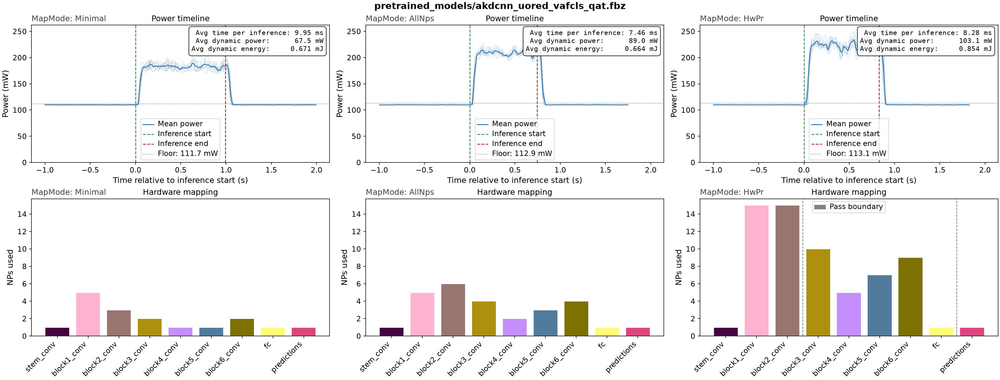
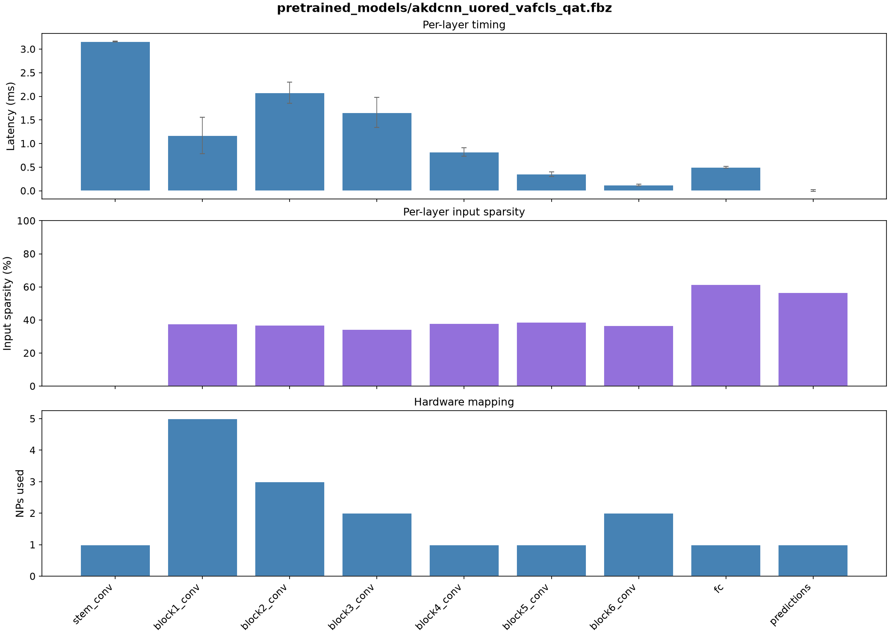
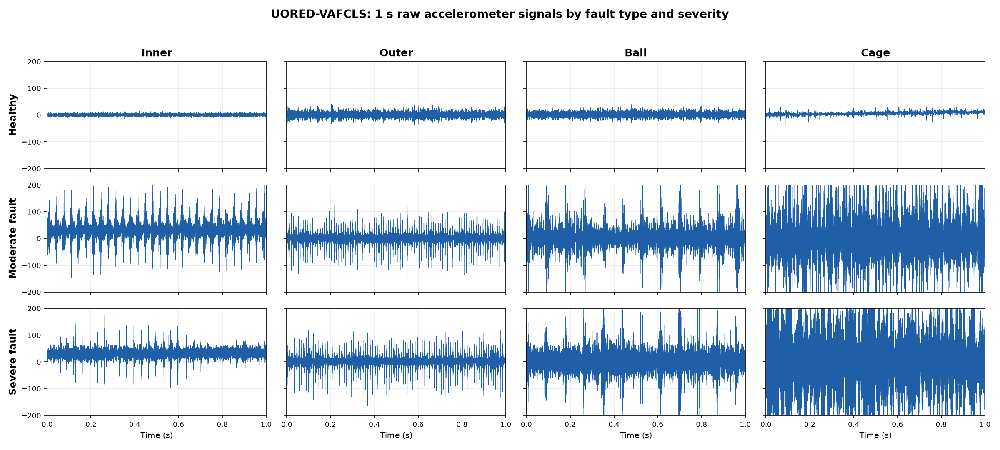
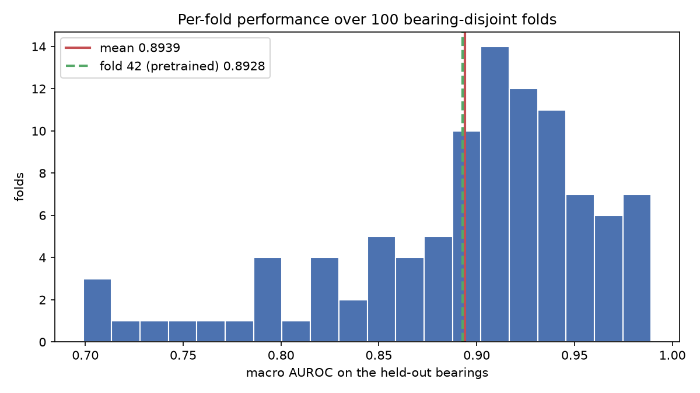

# Bearing Fault Diagnosis from Vibration data (UORED-VAFCLS)

Multi-label detection of rolling-element bearing faults — inner race, outer race, ball and cage — from one second of raw 42 kHz accelerometer data. The four faults are independent labels rather than classes, and a healthy bearing is the all-zero vector, not a fifth class. The reported metric is therefore macro AUROC, which needs no decision threshold.

This example tries to convey two different points:
- how to prepare and evaluate a model for Akida 1, for single-channel time-series data
- the particularities of this and related datasets that mean that special care needs to be taken in preparing the training and evaluation splits, and that comparison across published results is extremely difficult

## Model Card

**The table reports results for a single model architecture with only the method used to split the training and evaluation data changed.** See below for full details.

<table>
  <thead>
    <tr>
      <th>Split</th>
      <th>Float AUROC</th>
      <th>QAT AUROC</th>
      <th>Akida AUROC</th>
      <th>Params</th>
      <th>Activation sparsity</th>
    </tr>
  </thead>
  <tbody>
    <tr>
      <td>Segment-level</td>
      <td align="center">0.9983</td>
      <td align="center">0.9963</td>
      <td align="center">0.9973</td>
      <td align="center">335,444</td>
      <td align="center">39.06%</td>
    </tr>
    <tr>
      <td>Bearing-level</td>
      <td align="center">0.8950</td>
      <td align="center">0.8939</td>
      <td align="center">0.8939</td>
      <td align="center">335,444</td>
      <td align="center">37.81%</td>
    </tr>
  </tbody>
</table>

**AKD1500 hardware benchmark**

<table>
  <thead>
    <tr>
      <th>Mapping</th>
      <th>NPs</th>
      <th>Passes</th>
      <th>Cycles</th>
      <th>Latency (ms)</th>
      <th>Total Power (mW)</th>
      <th>Total Energy (mJ/inf)</th>
      <th>Dyn. Power (mW)</th>
      <th>Dyn. Energy (mJ/inf)</th>
    </tr>
  </thead>
  <tbody>
    <tr>
      <td>Minimal</td>
      <td align="center">17</td>
      <td align="center">1</td>
      <td align="center">3947210</td>
      <td align="center">9.868</td>
      <td align="center">178.5</td>
      <td align="center">1.784</td>
      <td align="center">66.6</td>
      <td align="center">0.666</td>
    </tr>
    <tr>
      <td>AllNPs</td>
      <td align="center">27</td>
      <td align="center">1</td>
      <td align="center">2932072</td>
      <td align="center">7.330</td>
      <td align="center">201.4</td>
      <td align="center">1.502</td>
      <td align="center">88.8</td>
      <td align="center">0.662</td>
    </tr>
  </tbody>
</table>

Measured on the model provided in the `pretrained_models/` folder, trained on the bearing-level split at fold 5.



`Minimal` mapping uses the fewest neural processors (NPs) that will hold the model; `AllNPs` spreads it over the available 
NPs without increasing the number of passes: in this case, because the model almost fills the device anyway, there is minimal
difference between these modes.

The model maps entirely to hardware in a single sequence, single pass.



## Requirements

See the [requirements section](../../../README.md#requirements) of the top-level README for the environment used 
throughout this repository.

## Dataset

**UORED-VAFCLS** — the University of Ottawa Rolling-element Dataset, Vibration and Acoustic Faults under Constant Load and Speed. 

This dataset comprises 60 accelerometer recordings, each 10 s at 42 kHz, from 20 bearings. Every bearing contributes three recordings:
one healthy, plus two severities of a single fault mode.

| | |
|---|---|
| Recordings | 60 (20 bearings × 3) |
| Length | 10 s at 42 kHz (420,000 samples) |
| Model input | 1 s window |
| Labels | 4 independent: inner, outer, ball, cage (healthy = all zero) |
| Windows per fold | 720 training (random crops), 240 held-out (tiled) |



Downloaded from [Mendeley Data, doi:10.17632/y2px5tg92h.5](https://data.mendeley.com/datasets/y2px5tg92h/5), licensed **CC BY 4.0** (https://creativecommons.org/licenses/by/4.0/):

> Sehri, Maryam; Dumond, Patrick (2023), *"University of Ottawa Rolling-element Dataset – Vibration and Acoustic Faults under Constant Load and Speed conditions (UORED-VAFCLS)"*, Mendeley Data, V5, doi: 10.17632/y2px5tg92h.5

*Changes made, as the licence requires us to state:* for convenience, we make the data required in this example available
as a single file for download from the BrainChip servers, that is, the `Accelerometer` column of the raw CSVs repacked
unmodified into a single float32 `.npz`.

## The Problem of Realistic Evaluation of Bearing Fault Diagnosis Models

This example draws very directly from the following article, which itself builds on a number of related publications that establish a 
widespread methodological problem in the evaluation of machine learning approaches to the key datasets in the diagnosis of bearing faults
from vibration data (UORED-VAFCLS used here, but even more strikingly in the key datasets in the domain, CWRU and Paderborn):

> J. P. Vieira, V. A. Bauler, R. K. Rosa, D. Silva, *"Towards a more realistic evaluation of machine learning models for bearing fault diagnosis"*, Mechanical Systems and Signal Processing 258:114640, 2026. doi:10.1016/j.ymssp.2026.114640 ([arXiv:2509.22267](https://arxiv.org/abs/2509.22267), [code](https://github.com/gama-ufsc/bearing-data-leakage))

The abstract from that article sets the context clearly: *"While recent advances in machine learning (ML), particularly 
deep learning, have shown strong performance in controlled settings, many studies fail to
generalize to real-world applications due to methodological flaws, most notably data leakage.
This paper investigates the issue of data leakage in vibration-based bearing fault diagnosis and
its impact on model evaluation. We demonstrate that common dataset partitioning strategies,
such as segment-wise and condition-wise splits, introduce spurious correlations that inflate
performance metrics."*

The risk is specific and easy to walk into. These datasets are built from a small number of physical bearings, each recorded
over a short, uninterrupted run under a single load and speed, and the fault mode is a property of the bearing rather than of
the signal: here, bearings 1–5 carry inner-race faults, 6–10 outer, 11–15 ball, 16–20 cage. Any split that lets windows from
one recording — or from one bearing — fall on both sides of the train/test boundary therefore hands the model a shortcut. It
can re-identify the recording from its noise floor, its mounting resonances or its running speed and read the label straight
off that identity, without learning anything transferable about bearing faults at all. Segment-wise splits (cutting each
recording in time) and condition-wise splits (holding out load or speed settings while keeping the same bearings) both leak in
exactly this way, and both are common in the published literature. The consequence is that near-perfect headline accuracies —
99%+ is routine on CWRU — measure the ease of recognising a recording, not the ability to diagnose an unseen bearing, and they
collapse as soon as the model meets hardware it has not been recorded on. It also makes cross-paper comparison largely
meaningless: two results on the same dataset are usually not measuring the same thing.

The reference citation above sets out a rigorous protocol for each of the datasets explored. The UORED-VAFCLS dataset used here 
has 60 recordings from **20 physical bearings**. A fold trains on 12 bearings and is tested on the 8 held out, the
key point being that an individual physical bearing never appears in both train and test data (even data from separate recordings
is disallowed, e.g. if the 'healthy' recording for bearing 0 is put in the train data, then the 'fault' recordings for that bearing
must not be in the test split). You can consult the details of the data split preparation in the relevant script, `uored_vafcls_data.py`.

That rigorous data split has knock-on consequences: the data splits are small enough that the choice of which bearings are held out
matters more than almost anything about the model:

- The **across-fold** standard deviation is 0.0666, and folds range from 0.6989 to 0.9892
  with the architecture, the recipe and the seed all held fixed. See the plot of below showing performance across folds.
- The **within-fold** standard deviation across random seeds is 0.0186 (measured over 25 folds at 3 
  seeds each).



So a single-fold, single-seed AUROC cannot distinguish two architectures on this dataset. It is absolutely necessary to run multi-fold
cross-validation to have anything approaching an accurate evaluation. For the bearing-wise split, this example follows the protocol
set out by the reference paper above:
1. **The reported number is the mean over all 100 evaluation folds**, produced by `uored_vafcls_cross_validate.py`. The per-fold results are committed in [`docs/cv_results.csv`](docs/cv_results.csv) so the mean is auditable without re-running anything.
2. **Folds 0–4 are the tuning budget.** Every hyperparameter — epochs, learning rate, the QAT schedule, the input encoding constants — was chosen there. Folds 5–104 are never tuned on.

### The Comparison: Segment-level Split
To demonstrate the importance of this rigorous leakage-free split (and, admittedly, to show that the model developed here for 
Akida is just as good as other published models, that the issue is on the data side, not the model) we present results for 
a segment-level split (i.e. every 10 second recording split to 6 seconds training, 4 seconds test data). Sure enough, the
model achieves **>99.5% AUROC**, and that without any further tuning for that version of the task.

## Dataset setup

The prepared cache downloads automatically on first use, to `--data` (default `./data/uored_vafcls`). To fetch it ahead of time:

```bash
python uored_vafcls_data.py -d ./data/uored_vafcls
```

If you prefer a different data location to the default (e.g. because your system has a dedicated data drive), you may find it
easy to set up a symbolic link from the default location. That way you can avoid passing the data path argument to all of the 
scripts:

```bash
ln -s /path/to/shared/uored_vafcls ./data/uored_vafcls
```

If you already hold the raw dataset, rebuild the cache from it instead. Download `1_CSV_Raw_Data_Files (.csv)` from the 
Mendeley record and point at the directory containing the five `1_Healthy` … `5_Cage_Faults` subfolders:

```bash
python uored_vafcls_data.py --prepare-raw /path/to/1_CSV_Raw_Data_Files
```


## Pipeline

| Stage | Description |
|---|---|
| Full-precision training | 30 epochs, Adam, batch 120 (6 steps/epoch), cosine decay with 5% warmup to a peak LR of 2e-4 |
| Post-training quantization | `cnn2snn quantize` reduces to 4-bit weights and activations (8-bit input) |
| Quantization-aware tuning | 10 epochs at a peak LR of 5e-5, recovering almost all of the quantization loss |
| Conversion to Akida | `cnn2snn convert` produces the `.fbz` model that runs on hardware |

## Reference Models

The trained models in `pretrained_models/` are stored with Git LFS. See the [trained models section](../../../README.md#trained-models) of the top-level README if they arrive as text pointer files rather than real weights.

These models are necessarily trained on a specific fold. For that, we've selected fold 42, because performance is close to the 100-fold cross-validation value 
(obviously, that in itself doesn't make the single-fold accuracy value any more meaningful; rather we hope to avoid any misunderstandings about performance
if a reader is not following the detail of this example). In any case, the pretrained model is only used for benchmarking on hardware which, since the architecture
is constant, should be more or less constant across folds (will vary only to the extent that learned sparsity within the model varies across training runs).

## Usage

### Notebook

> ⚠️ **Work in progress — the notebooks are not included in this release yet.** The section below describes what they will
> cover; until they land, use the scripts described under [Script](#script). The links will not resolve.

[`uored_vafcls_notebook_training.ipynb`](uored_vafcls_notebook_training.ipynb) walks through the whole pipeline on a single fold: the dataset and its two leakage traps, how a 1 s waveform becomes a framed uint8 tensor, training, quantization, tuning and conversion. It also loads `docs/cv_results.csv` to show the fold distribution without needing a two-hour run.

[](https://colab.research.google.com/github/Brainchip-Inc/brainchip_devhub/blob/main/akida1/model_zoo/uored_vafcls/uored_vafcls_notebook_training.ipynb)

[`uored_vafcls_notebook_benchmark.ipynb`](uored_vafcls_notebook_benchmark.ipynb) evaluates the converted model, measures activation sparsity, and runs the hardware latency and power benchmarks.

> **Note:** the benchmark notebook needs a physical AKD1500 device, so it does not run in Colab. The power measurements additionally need the FTDI current sensor.

### Script

Run the full pipeline on one fold — build, train, quantize, tune, convert, evaluate at each stage, and benchmark:

```bash
bash uored_vafcls_train.sh [DATADIR] [FOLD] [SEED]
```

`FOLD` defaults to 5 and `SEED` to 0. It takes about a minute on a single GPU, plus benchmarking. The nine steps are the standard Akida 1 sequence; see the script for the exact commands.

### Cross-validation

**This is the command that produces the headline number.**

```bash
python uored_vafcls_cross_validate.py --save-metrics
```

It runs the whole chain on each of the 100 evaluation folds, appending to `docs/cv_results.csv` after every fold, and takes roughly 30–60 minutes. 
It resumes by default, so an interrupted run picks up where it stopped. Add `--skip-akida` for a roughly 4× faster float-only sweep when comparing 
recipes, and `--first-fold`/`--last-fold` to split the work across machines, or to limit to the first 5 folds (0-4) if working on tuning the model
or pipeline (remember, folds 5-104 are for the final evaluation only).

## Contributing and Maintenance

`README.md` in this folder is **generated** — edit [`docs/README.md.template`](docs/README.md.template), never `README.md` directly. The performance 
tables are filled from `docs/metrics.json`, which is written by the `--save-metrics` flags (if updating results following changes to the model or
pipeline, remember to delete the `.csv` files first, or use the `--no-resume` argument on the cross-validation runs):

```bash
# Bearing-level split (the protocol) - the Model Card's bottom row.
# Its AUROCs come from the sweep, never from a single model.
python uored_vafcls_cross_validate.py --save-metrics                        # 30-60 min
python uored_vafcls_cross_validate.py --first-fold 5 --last-fold 29 --seeds 3 \
    -o docs/cv_seed_std.csv --save-seed-std                                 # the seed-noise figure
python uored_vafcls_eval.py -l pretrained_models/akdcnn_uored_vafcls.h5 --save-metrics       # params
python uored_vafcls_eval.py -l pretrained_models/akdcnn_uored_vafcls_qat.fbz --save-metrics  # sparsity
python uored_vafcls_benchmark.py -l pretrained_models/akdcnn_uored_vafcls_qat.fbz --save-metrics

# Naive segment-level split (the comparator) - the Model Card's top row.
# One model, one run: the split is singular and its score is stable to ~0.001.
bash uored_vafcls_naive_split.sh
python uored_vafcls_eval.py -l models/akdcnn_uored_vafcls_segment.h5 --split-mode segment --save-metrics
python uored_vafcls_eval.py -l models/akdcnn_uored_vafcls_segment_qat.h5 --split-mode segment --save-metrics
python uored_vafcls_eval.py -l models/akdcnn_uored_vafcls_segment_qat.fbz --split-mode segment --save-metrics

python update_readme.py
```

Each key in `metrics.json` has exactly one writer, so the scripts can be run in any order without racing. There is deliberately no bearing-level single-model AUROC: nothing in the README reports one, because reporting one is the mistake this example is about.

**The standing rule:** any change to the architecture, the training recipe or the `ENCODE_*` constants invalidates the cross-validated table, and requires a fresh 100-fold sweep. Re-running the fixed fold is *not* a substitute — that is the whole point of this example.
