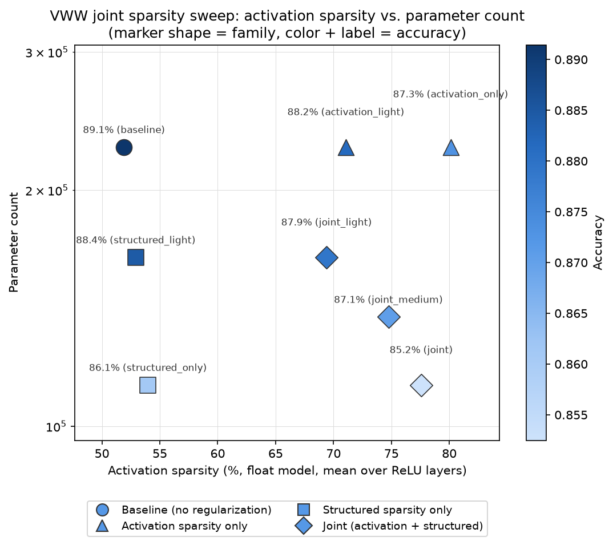

# VWW joint activation + structured sparsity pilot

Tracking doc for a followup to **"Akida 1: Sparsify VWW model"** — investigating
whether VWW (AkidaNet alpha=0.25) can be pushed on **two independent sparsity axes
at once** without accuracy dropping faster than either alone:

- **Activation sparsity** (already explored in `SPARSITY_EXPERIMENT.md`): fraction of
  zero-valued ReLU activations, driven by an activity regularizer. `hoyer_square_norm`
  at `reg=3.6` was the established best point (70.4% sparsity, 2.6pt accuracy cost).
- **Structured (channel/filter) sparsity** (new): fraction of pruned SeparableConv2D
  output channels, which reduces the model's actual parameter count. Unlike
  activation sparsity, Akida 1 hardware does **not** accelerate on weight sparsity —
  this axis is about model footprint, not runtime latency.

Branch: `akida1-sparsify-vww-joint`.

## Scope decisions

- **Float models only.** No `cnn2snn quantize`/QAT/`convert`/Akida eval anywhere in
  this pilot. This also sidesteps the hardware-vs-software-simulator sparsity
  discrepancy `SPARSITY_EXPERIMENT.md` had to work around — activation sparsity here
  is measured directly on float ReLU outputs (`vww_float_sparsity.py`), not via
  `akida_models.sparsity.compute_sparsity`.
- **Structured sparsity method: Network Slimming** (Liu et al., 2017). An L1 penalty
  on each targeted BatchNormalization layer's `gamma` during training identifies
  which output channels of the preceding `SeparableConv2D` matter least; those
  channels are then physically pruned and the model rebuilt smaller
  (`vww_structured_sparsity.py`). No pruning tooling exists anywhere in
  `akida_models`/`quantizeml`/`cnn2snn` (confirmed by grepping the installed
  packages), so this was built from scratch for this experiment.
- **Pruning scope**: `separable_4` .. `separable_12` (9 of the 10
  `SeparableConv2D` blocks). `conv_0`-`conv_3` (stem) and `separable_13` are left
  untouched, since the classifier head (`predictions`) reads `separable_13/relu`
  directly (`vww_model.py:42`) — pruning it would also require resizing that Dense
  layer, extra risk not needed for a pilot.
- **Pilot scope**: a 2x2 grid, not a full sweep — baseline, activation-only,
  structured-only, and joint, reusing `hoyer_square_norm` `reg=3.6` for the
  activation corner (no re-derivation) and a starting guess of 40% per-layer channel
  pruning for the structured corner (no prior data point exists for this axis).

## Pipeline per grid point

1. Build model (`build_vww_model`, pretrained ImageNet backbone).
2. If structured sparsity is active: attach an L1 loss on the targeted BN layers'
   gamma (`add_gamma_l1_loss`).
3. **Phase 1** float train (40 epochs), with the activation regularizer attached to
   every ReLU layer if activation sparsity is active (reusing `train_vww` from
   `vww_train.py`).
4. If structured sparsity is active: prune (`prune_model`) and **Phase 2** float
   fine-tune (15 epochs) to recover accuracy lost to channel surgery, re-attaching
   the activation regularizer (pruning rebuilds fresh layers that don't carry it
   over).
5. Measure float accuracy, float activation sparsity, and parameter count.

## Results

Ran on GPU 1 of the shared training box (`CUDA_VISIBLE_DEVICES=1`); the initial 2x2
pilot (4 points) took ~1h40m, the follow-up (4 more points) another ~2h10m -- 40
float epochs for the no-prune points, plus a 15-epoch post-prune fine-tune for
every pruned point (see `joint_sweep_run.log` / `joint_sweep_followup.log`).
`vww_train.py`'s `model.fit` call needed `workers=8, use_multiprocessing=True,
max_queue_size=32` added (this experiment's one change to existing code) to stop
the single-threaded `ImageDataGenerator` from CPU-starving the GPU -- that cut
per-epoch time roughly 7.5x (~30min -> ~4min on a cold page cache; faster still
once the dataset was warm in RAM for later grid points).

| tag | reg (hoyer_square_norm) | prune target | accuracy | activation sparsity | params |
|---|---:|---:|---:|---:|---:|
| baseline | 0 | 0% | 89.14% | 51.9% | 226,906 |
| activation-only | 3.6 | 0% | 87.32% | 80.1% | 226,906 |
| structured-only | 0 | 40% | 86.11% | 54.0% | 112,879 |
| joint | 3.6 | 40% | 85.25% | 77.6% | 112,879 |

**Follow-up (lighter settings)**, run after the pilot above to check whether a lighter
touch on both axes trades away less accuracy (`vww_joint_sparsity_sweep.py --points`,
appending to the same summary CSV rather than re-running the pilot):

| tag | reg | prune target | accuracy | activation sparsity | params |
|---|---:|---:|---:|---:|---:|
| activation_light | 1.5 | 0% | 88.17% | 71.1% | 226,906 |
| structured_light | 0 | 20% | 88.45% | 52.9% | 164,162 |
| **joint_light** | **1.5** | **20%** | **87.92%** | **69.4%** | **164,162** |
| joint_medium | 2.5 | 30% | 87.06% | 74.7% | 137,836 |

Note: activation sparsity here is measured directly on float ReLU outputs
(`vww_float_sparsity.py`), not via `akida_models.sparsity.compute_sparsity` on a
quantized/converted model -- so these percentages are **not** directly comparable
to `SPARSITY_EXPERIMENT.md`'s Akida-measured numbers (e.g. that experiment's
`hoyer_square_norm reg=3.6` point was 70.4% on the converted model vs. 80.1% here
on the float model for the same `reg`). Valid to compare *within* this table only.

## Findings

- **The two axes are complementary, not merely additive.** Accuracy cost from
  baseline: activation-only alone costs 1.82pt (89.14% -> 87.32%); structured-only
  alone costs 3.03pt (89.14% -> 86.11%); naive addition would predict ~4.85pt for
  both together. The joint corner actually costs **3.89pt** (89.14% -> 85.25%) --
  *less* than the sum of its parts, while still landing close to each single-axis
  corner's own best number on its own metric (77.6% sparsity vs. activation-only's
  80.1%; 112,879 params, identical to structured-only's own count since the prune
  target directly sets the parameter count regardless of the activation regularizer).
- **Practical read: pushing both together is a good trade.** The joint model gets
  essentially all of structured-only's parameter reduction (-50%) *and* most of
  activation-only's sparsity gain, for less than a further 1-point accuracy cost
  beyond structured-only alone (86.11% -> 85.25%). If the project wants both a
  smaller model and higher activation sparsity, doing them jointly is cheaper than
  the accuracy budget of doing them as two separate, stacked decisions would
  suggest.
- **Structured pruning's accuracy cost (3.03pt) exceeds activation sparsity's
  (1.82pt) at these specific settings** (`prune_target=40%` vs. `reg=3.6`), but the
  two aren't on a common x-axis (channel-fraction vs. regularizer strength), so
  this isn't a claim that one technique is "better" -- only that this pilot's two
  starting-guess operating points happened to land at different costs on their own
  axes.
- **Lighter settings recover most of the accuracy for most of the benefit.**
  Halving both knobs (`reg` 3.6->1.5, `prune_target` 40%->20%) turns the joint
  corner's 3.89pt accuracy cost into just **1.22pt** (89.14% -> 87.92%,
  `joint_light`), while still keeping 69.4% activation sparsity (vs. the
  aggressive joint's 77.6%) and a 28% parameter cut (vs. 50%). The three joint
  points now on hand (`joint_light` 1.22pt/69.4%/-28%, `joint_medium` 2.08pt/
  74.7%/-39%, `joint` 3.89pt/77.6%/-50%) trace a smooth, non-cliff curve --
  accuracy degrades gradually as both knobs are turned up together, the same
  shape each knob shows on its own axis (`SPARSITY_EXPERIMENT.md`; this pilot's
  activation-only/structured-only points). There's no evidence of a sudden
  collapse anywhere in the range tested.
- **Recommendation: `joint_light` (reg=1.5, prune_target=20%) is the best
  tradeoff found so far** if minimizing accuracy loss is the priority --
  87.92% accuracy (1.22pt drop) with a meaningfully smaller, meaningfully
  sparser model than baseline. `joint`/`joint_medium` remain the better picks
  only if the priority shifts toward maximizing sparsity or size reduction and
  a larger accuracy budget is acceptable.

## Open questions / next steps

- All three joint points sit at (reg, prune_target) pairs chosen to move together
  (1.5/20%, 2.5/30%, 3.6/40%) -- the two knobs haven't been varied independently
  within the joint setting (e.g. a high-reg/low-prune or low-reg/high-prune point),
  so it's not yet known whether the accuracy cost depends on the two knobs
  symmetrically or whether one axis is cheaper to push than the other once both
  are active.
- Nothing lighter than `reg=1.5`/`prune_target=20%` has been tried -- if an even
  smaller accuracy drop is wanted, the next step is pushing further down this same
  direction (e.g. `reg=0.5-1`, `prune_target=10-15%`) rather than a new direction.
- `gamma_l1_strength=1e-5` has been held fixed across every structured/joint point
  in this doc -- it hasn't been swept at all, so it's still an open question
  whether tuning it (independent of `prune_target`) changes which channels get
  selected for pruning and how much accuracy that costs.
- This pilot has no real hardware/latency angle (float-only, and Akida doesn't
  accelerate on weight sparsity anyway) -- the parameter-count reduction is purely a
  model-footprint argument, not a latency one. If the joint approach looks worth
  adopting, getting it through the full `cnn2snn quantize`/QAT/`convert` pipeline and
  measuring real Akida-hardware sparsity/latency would be the natural next step to
  make it comparable to `SPARSITY_EXPERIMENT.md`'s numbers.
