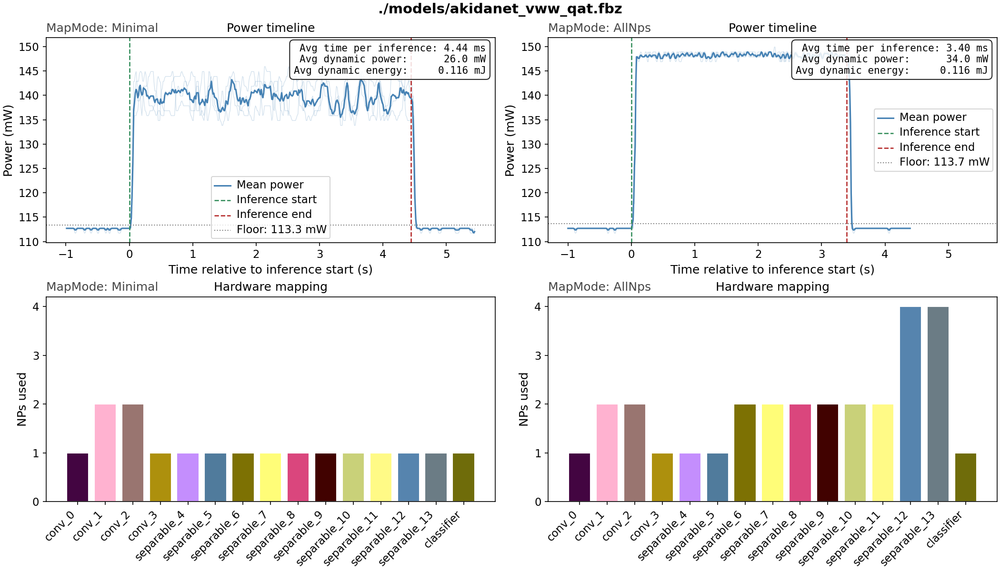
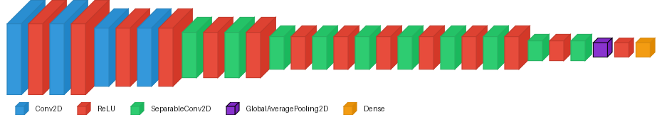
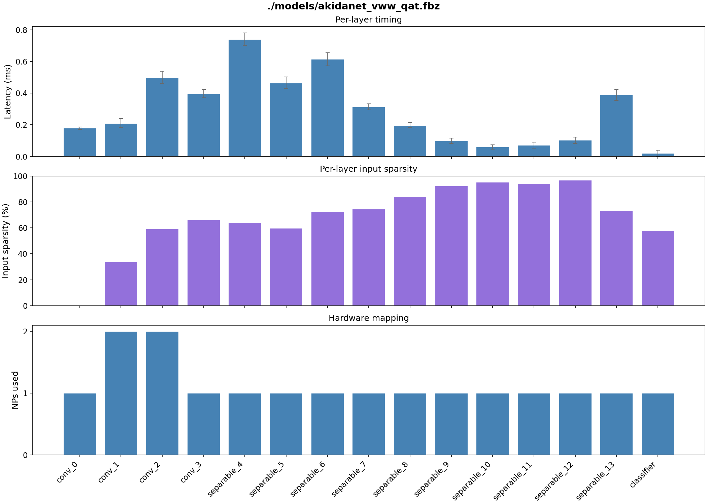

# Visual Wake Words (VWW)

## Model Card

<table>
  <thead>
    <tr>
      <th>Float acc.</th>
      <th>QAT acc.</th>
      <th>Akida acc.</th>
      <th>Sparsity</th>
      <th>Params</th>
    </tr>
  </thead>
  <tbody>
    <tr>
      <td align="center">89.33%</td>
      <td align="center">88.54%</td>
      <td align="center">88.42%</td>
      <td align="center">68.29%</td>
      <td align="center">226,906</td>
    </tr>
  </tbody>
</table>

**AKD1500 hardware benchmark**

<table>
  <thead>
    <tr>
      <th>Mapping</th>
      <th>NPs</th>
      <th>Passes</th>
      <th>Cycles</th>
      <th>Latency (ms)</th>
      <th>Total Power (mW)</th>
      <th>Total Energy (mJ/inf)</th>
      <th>Dyn. Power (mW)</th>
      <th>Dyn. Energy (mJ/inf)</th>
    </tr>
  </thead>
  <tbody>
    <tr>
      <td>Minimal</td>
      <td align="center">17</td>
      <td align="center">1</td>
      <td align="center">1743040</td>
      <td align="center">4.358</td>
      <td align="center">139.3</td>
      <td align="center">0.619</td>
      <td align="center">26.0</td>
      <td align="center">0.116</td>
    </tr>
    <tr>
      <td>AllNPs</td>
      <td align="center">29</td>
      <td align="center">1</td>
      <td align="center">1325867</td>
      <td align="center">3.315</td>
      <td align="center">147.7</td>
      <td align="center">0.502</td>
      <td align="center">34.0</td>
      <td align="center">0.116</td>
    </tr>
  </tbody>
</table>



The plot above shows power measurements captured during inference on hardware.
In **Minimal** mapping the model is scheduled onto the fewest NPs required,
keeping power consumption low. Switching to **AllNps** spreads the model across
more NPs (visible in the lower trace plots), which results in a slight increase
in power during inference but a proportional reduction in latency.

The model is a standard **Akidanet** (from `akida_models`) with
width multiplier **alpha = 0.25** and input resolution **96 × 96**.



Latency can also be profiled on a per-layer basis, making it possible to see
which layers dominate processing time. This is determined by several factors:
the volume of inputs to the layer and its number of filters, the type of layer
and kernel size, and the number of NPs the layer is spread over. On Akida,
input activation sparsity is another strong determinant — layers where input
sparsity is particularly high take very little processing time.



## Requirements

For environment requirements and setup, see the [Requirements](../../../README.md#requirements)
section of the top-level README.

## Dataset


Visual Wake Words is a binary image classification benchmark, specifically
designed to target edge deployment on resource-constrained devices. It is
derived from the MS-COCO 2014 dataset. Each image is labelled **person**
or **non-person** based on whether a person occupies at least 2% of the frame.
Images are resized to **96 × 96 RGB**. The dataset contains approximately
115k training images and 8k validation images.

Reference: Chowdhery et al., *Visual Wake Words Dataset* (2019),
[arXiv:1906.05721](https://arxiv.org/abs/1906.05721).

## Dataset setup

The dataset can be downloaded from the SiLabs ML benchmarks mirror:

```bash
wget https://www.silabs.com/public/files/github/machine_learning/benchmarks/datasets/vw_coco2014_96.tar.gz
tar -xzf vw_coco2014_96.tar.gz
```

The scripts default to looking for the data at `./data/vw_coco2014_96`. If you
want to store the dataset on a dedicated data drive, you can pass the path
explicitly to each script (see `--data` / `-d` in the individual scripts).
Alternatively, it may be more convenient to keep the dataset in its preferred
location and create a symbolic link from the default path (one-off step):

```bash
ln -s /path/to/your/data/vw_coco2014_96 ./data/vw_coco2014_96
```

This way the scripts work out of the box without any extra arguments.

## Pipeline

Training follows a three-stage quantization pipeline, followed
by conversion to Akida format:

| Stage | Description |
|---|---|
| Full-precision | Float32 training from scratch, 20 epochs |
| Post-training quantization | `cnn2snn quantize` reduces to 4-bit weights and activations (8-bit input) |
| Quantization-aware tuning | 5 epochs fine-tuning of the quantized model to recover accuracy |
| Conversion to Akida | Automated conversion to Akida model format |

## Reference Models

Pretrained models are made available here, within the `pretrained_models/`
folder. However, those are handled using the `git-lfs` package (git large
file storage). For those to be downloaded with the repo, you will need to
set up `git-lfs`. For further instructions, see the
[Trained models](../../../README.md#trained-models) section of the top-level README.

## Usage

### Notebook

Two notebooks are provided that walk through a) preparation of a trained Akida-compatible model and
b) evaluation and benchmarking of that model on Akida.

[vww_notebook_training.ipynb](vww_notebook_training.ipynb) walks through the 
complete training pipeline end-to-end. It is written to expose and explain the Akida-specific
aspects of the workflow: how the model is constructed for Akida compatibility,
what the quantization constraints mean in practice, and what the conversion
step does. Start here if you want to understand *why* the pipeline is structured
the way it is.

[](https://colab.research.google.com/github/Brainchip-Inc/brainchip_devhub/blob/main/akida1/model_zoo/vww/vww_notebook_training.ipynb)

[vww_notebook_benchmark.ipynb](vww_notebook_benchmark.ipynb) walks through 
evaluation of model accuracy on Akida and, if a hardware device is available, covers benchmarking
of model latency and power.

> **Note:** the hardware benchmark section reads live power measurements from a physical AKD1500
> device over I2C. It will not run in Colab — use it locally with a connected board.

### Script

For straightforward reproduction of the training and evaluation results, run
the full pipeline in one shot:

```bash
bash vww_train.sh [DATADIR]
```

The optional `DATADIR` argument overrides the default dataset location
(`./data/vw_coco2014_96`).

That will take about 1 hour to run if a modern GPU is available.

## Contributing and Maintenance

This README is autogenerated generated from `docs/README.md.template`
so that the accuracy and hardware benchmark values are written directly 
by the code (via the `metrics.json` file, also in the docs folder).

When the associated model or training pipeline is modified to improve
performance, you should rerun the evaluations of the float, quantized
and Akida model versions, plus the hardware benchmark, including the 
`--save-metrics` argument, and then regenerate the README from the template
using `update_readme.py`: 
```bash
python vww_eval.py -l pretrained_models/akidanet_vww.h5 --save-metrics
python vww_eval.py -l pretrained_models/akidanet_vww_qat.h5 --save-metrics
python vww_eval.py -l pretrained_models/akidanet_vww_qat.fbz --save-metrics
python vww_benchmark.py -l pretrained_models/akidanet_vww_qat.fbz --save-metrics
python update_readme.py
```
Then commit the changed files (template, metrics and updated README).

Likewise, if you want to edit the contents of this README, you should
not edit it directly, but instead edit `docs/README.md.template` and 
then regenerate the README using
``` bash
python update_readme.py
```
