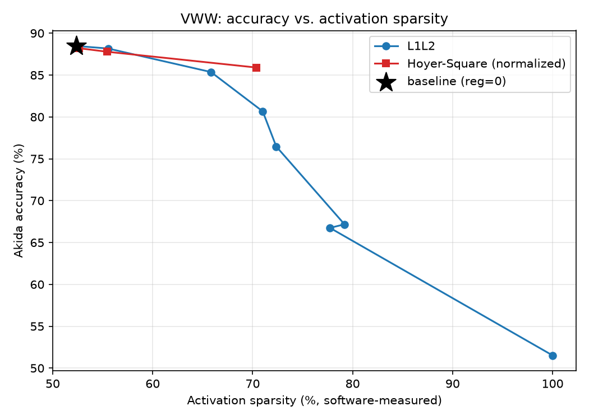

# Tutorial: Inducing Activation Sparsity in VWW

Akida is an event-driven architecture — inference cost scales with the number
of **non-zero activations**, not tensor size. This tutorial is a focused,
hands-on look at that one lever: how much sparsity you can induce in a
trained model via activity regularization, what it costs in accuracy, and
(where hardware is available) what it's actually worth in latency and power.

It builds on the **Visual Wake Words** example in
[`akida1/model_zoo/vww`](../../model_zoo/vww) — reusing that folder's model,
training, and data code unmodified — so start there first if you want the
full training/quantization/conversion pipeline explained. This tutorial picks
up where that leaves off and stays entirely on the sparsity question.

## Notebook

[vww_sparsity_notebook.ipynb](vww_sparsity_notebook.ipynb) covers:

- How activation sparsity is induced: an `activity_regularizer` on every
  ReLU layer, comparing **L1L2** against a scale-invariant **normalized
  Hoyer-Square** penalty ([DeepHoyer](https://arxiv.org/abs/1908.09979),
  Yang, Wen & Li, ICLR 2020).
- **Accuracy vs. sparsity**, swept across regularization strengths for both
  regularizer types.
- **Per-layer sparsity** — where the gains actually land in the network.
- **Benchmarking** — latency/power impact on AKD1500 hardware (runs
  immediately if a device is connected; the results in this repo's committed
  notebook were produced without one — see below).

## Results at a glance

Best trade-off found: **normalized Hoyer-Square at `reg=3.6` — 70.4%
(software-measured) activation sparsity for a 2.6pt accuracy cost** (88.47% ->
85.90% Akida accuracy), beating L1L2's own best point (`reg=1e-6`: 65.8%
sparsity, ~3.1pt cost) on both axes at once.

Full experiment log — every sweep pass, the Hoyer-Square calibration
diagnostic, and open questions — is in
[`SPARSITY_EXPERIMENT.md`](../../model_zoo/vww/SPARSITY_EXPERIMENT.md) (in the
vww/ example folder; this tutorial's notebook is the polished, code-first
walkthrough of the same experiment).

## Setup

Reuses the vww/ example's dataset — `data/` here is a symlink to
`../../model_zoo/vww/data`. If that folder doesn't exist yet, follow the
[Dataset setup](../../model_zoo/vww/README.md#dataset-setup) instructions
there first (or just run the notebook on Colab, which downloads its own
copy).

`results/*.csv` and `results/per_layer_sparsity.json` are small precomputed
sweep summaries checked into this repo so the notebook's plots reproduce
without a multi-hour retrain. The full-size model checkpoints behind them are
not committed, matching this repo's convention of not checking in trained
model artifacts — re-run `vww_sparsity_sweep.py` (see the notebook) to
regenerate them.
